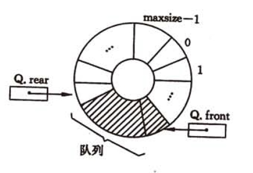
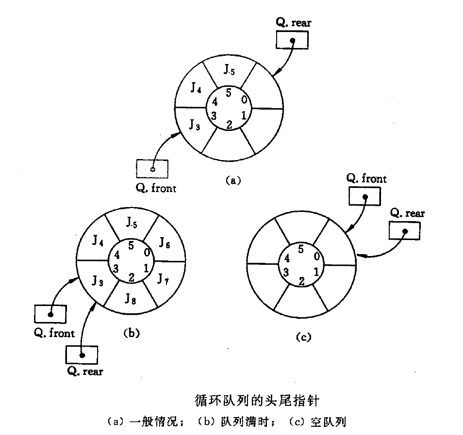
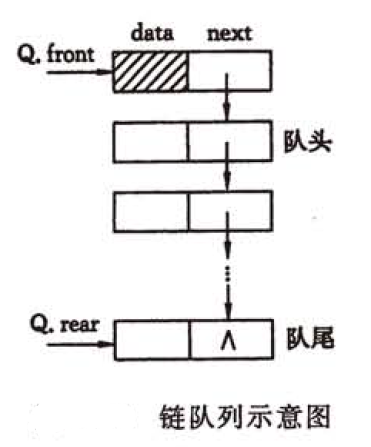
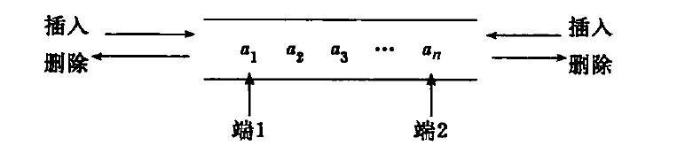

--- 
[注] 本文带 * 的配图均来自  ***[数据结构(C语言版)].严蔚敏 吴伟民***

> ### 快速导航
> [栈](#stack)  
> [队列](#queue)  
> [总结](#summary)

--- 
<h2 id="stack">栈</h2>
--- 
### 基本概念
**栈(stack)**： 只允许在一端进行插入或删除操作的线性表。示意图（*）如下：  
  

**栈顶(top)**：线性表允许进行删除和插入的一端。  
**栈底(bottom)**：固定的，不允许进行插入和删除的一端。  
**空栈**：不含任何元素的空表。  

上图中a1为栈底元素，an为栈顶元素。进栈次序为： a1->a2->a3->...->an，而出栈次序为：a(n)->a(n-1)->a(n-2)->...->a1。由此可见，栈的一个明显操作特性为**后进先出(Last In First Out, LIFO)**，故又称后进先出的顺序表。  

#### 基本操作
以下基本操作应熟记：  
```cpp
Stack Init();              //始化一个空栈
bool IsEmpty(stack);       //判断栈是否为空
void Push(data);           //压栈
StkData Pop();             //弹栈
StkData GetTop();          //读栈顶元素
void Clear();              //销毁栈
```

### 栈的顺序存储结构
### 顺序栈的实现
栈的顺序存储成为顺序栈，它是利用一组地址连续的存储单元存放自栈底到栈顶的数据元素，同时附有一个指针(top)指示当前栈顶的位置。  
栈的顺序存储类型可以表示为：  
```cpp
#define MAXSIZE 1024

typedef struct
{
    StkData data[MAXSIZE];
    int top;
}SeqStack;
```
栈顶指针： s.top，初始设置top=-1；  
栈顶元素： s.data[top]；  
压栈操作：栈未满时，栈顶指针先+1，再存入值。  
弹栈操作：栈非空时，先取栈顶元素值，再将栈顶指针-1。  
判空：s.top = -1;  
判满：s.top == MAXSIZE-1；  
栈长：s.top+1；  

  

### 顺序栈的基本运算
栈操作的示意图如上图所示，通过该图应深刻理解栈顶指针以及判空指针为-1的作用。  
下面是顺序栈一些常用操作的c++类实现：  
```cpp
#define MAXSIZE 1024

typedef struct
{
  int value;
}StkData;

class SeqStack
{
  public:		
    ~SeqStack();
    //通过构造函数初始化 
    SeqStack()
    {
      data = new StkData[MAXSIZE];
      //指针初始化为-1使得判空判满操以及压栈弹栈能够统一处理
      top = -1;
    }
    //判空操作 
    bool IsEmpty()
    {
      return top == -1;
    }
    //判满
    bool IsFull()
    {
      return top == MAXSIZE-1;
    } 
    //压栈
    bool Push(StkData e)
    {
      if (IsFull())
        return false;
      //指针先加1再存值 
        data[++top] = e;
        return true; 
    } 
    //弹栈 
    StkData Pop()
    {
      if (IsEmpty())
        return NULL;
      //先取值指针再-1 
      return data[top--];
    }
    //读取栈顶元素而不将栈顶弹出 
    StkData GetTopData()
    {
      if (IsEmpty())
        return NULL;

      return data[top];
    }
    //清空栈
    void Clear()
    {
      data = new StkData[MAXSIZE];
      top = -1;
    }

  private:
    StkData data[MAXSIZE];
    int top;

}; 
```
**[注]：考研中数据结构一般不会使用面向对象的语法，如类Class等，所以这里的SeqStack类仅供参考，重点在于基本操作（类中函数的实现），在考试中不要使用类去做题。**

--- 
### 共享栈
利用栈底位置相对不变的特性，可以让两个顺序栈共享一个一维数据空间，将两个栈的栈底分别设置在共享空间的两端，两个栈顶向共享空间的中间延伸，如下图所示：  


两个栈的栈顶指针都指向栈顶元素，top0=-1时0号栈为空，top1=MAXSIZE时1号栈为空。仅当两个栈顶指针相邻（top1-top0=1）时，判断为栈满。当0号栈压栈时top0先+1再赋值，1号栈压栈时top1先-1再赋值。弹栈则刚好相反。  
共享栈是为了更有效的利用存储空间，两个栈的空间相互调节，只有在整个存储空间被沾满时才发生上溢。其存取数据的时间复杂度为O(1)。

共享栈的代码如下：
```cpp
#define MAXSIZE 2048 
typedef struct
{
  int value;
}StkData;

typedef struct
{
  StkData data[MAXSIZE];
  int ltop;
  int rtop; 
}SStack;

class SStakeUtility
{
  public:
    //初始化共享栈 
    SStack Init()
    {
      SStack sstk;
      sstk.data = new StkData[MAXSIZE];
      sstk.ltop = -1;
      sstk.rtop = MAXSIZE;
      
      return sstk;
    }
    //判左栈空 
    bool IsLeftStackEmpty(SStack sstk)
    {
      return sstk.ltop == -1;
    }
    //判右栈空 
    bool IsRightStackEmpty(SStack sstk)
    {
      return sstk.rtop == MAXSIZE;
    }
    //判栈满
    bool IsFull(SStack sstk)
    {
      return sstk.rtop - sstk.ltop == 1;
    } 
    //清空共享栈
    void Clear(SStack& sstk)
    {
      delete sstk.data;
      sstk.ltop = -1;
      sstk.rtop = MAXSIZE;
    } 
    
    //左栈压栈
    bool PushLeft(SStack& sstk, StkData e)
    {
      if (IsFull(sstk))
          return false;
          
        sstk.data[++sstk.ltop] = e;
        return true;
      } 
      //左栈弹栈
    StkData PopLeft(SStack& sstk)
    {
      if (IsLeftStackEmpty(sstk))
          return NULL;
    
            return sstk.data[sstk.ltop--];
      } 
      //取左栈栈顶元素而不弹栈
    StkData GetLeftTop(SStack sstk)
    {
      if (IsLeftStackEmpty(sstk))
          return NULL;
    
            return sstk.data[sstk.ltop];
    } 
    //清空左栈
      void ClearLeft(SStack& sstk)
      {
        sstk.ltop = -1;
    }
      
      //右栈压栈
    bool PushRight(SStack& sstk, StkData e)
    {
      if (IsFull(sstk))
          return false;
          
        sstk.data[--sstk.rtop] = e;
        return true;
      } 
      //右栈弹栈
    StkData PopRight(SStack& sstk)
    {
      if (IsLeftStackEmpty(sstk))
          return NULL;
    
            return sstk.data[sstk.rtop++];
      } 
      //取右栈栈顶元素而不弹栈
    StkData GetLeftTop(SStack sstk)
    {
      if (IsLeftStackEmpty(sstk))
          return NULL;
    
            return sstk.data[sstk.rtop];
    } 
    //清空右栈
    void ClearLeft(SStack& sstk)
    {
      sstk.rtop = MAXSIZE;
    }
};
```

--- 
### 栈的链式存储结构 
采用链式存储的栈称为链栈，链栈的优点是便于多个栈共享存储空间和提高效率，且不存在栈满上溢的情况。  
通常链栈采用单链表实现，并规定所有操作都是在单链表的表头进行的。规定链栈没有头结点，只有栈顶指针。如下图所示：  
 

--- 
因为链栈的实现就是链表，只是在操作上有所不同，这里只给出链栈的基本操作代码，不对其进行详细讨论。  
```cpp
typedef struct 
{
  int value;
}StkData;

typedef struct StkNode
{
  StkData value;
  struct StkNode *next;
}StkNode, *pStkNode;

class Stack : public
{
public:
  //初始化
  void Stack()
  {
    top = NULL;
  }
  //读取头结点
  pStkNode GetTop()
  {
    pStkNode tmpHead = top;
    return tmpHead;
  }
  //判空
  bool IsEmpty()
  {
    return top == NULL;
  }
  //压栈
  bool Push(StkData data)
  {
    pStkNode n = new pStkNode;
    n->data = data;
    n->next = top;
    top = n;
    return true;
  }
  //弹栈
  pStkNode Pop()
  {
    if (IsEmpty())
      return NULL;
    
    pStkNode tmp = top;
    top = top->next;
    return tmp;
  }
  //清空栈
  void Clear()
  {
    while (top)
    {
      pStkNode tmp = top->next;
      delete top;
      top = tmp;
    }
    
    top = NULL;
  }
private:
  pStkNode top;
}
```
--- 
<h2 id="queue">队列</h2>

--- 
### 定义
队列（queue）简称队，也是一种操作受限的线性表，只允许在表的一端进行插入，另一端进行删除。在队列中插入元素称为入队，删除元素称为离队。操作特性是**先进先出（First In First Out，FIFO）**，故又称先进先出的线性表。示意图（*）如下：  


### 常见基本操作  
```cpp
Queue Init();                           //初始化一个空队列
bool IsEmpty(Queue q);                  //判空
void Enqueue(Queue& q, QueueData e);    //入队
QueueData Dequeue(Queue& q);            //出队
QueueData GetHead(Queue& q);            //获取对首元素而不出队
```

### 队列的顺序存储结构 
队列的顺序实现是指分配一块连续的存储单元存放队列中的元素，并附有两个指针front和rear分别指示队头元素和队尾元素的位置。  

队列的顺序存储类型可描述为：  
```cpp
#define MAXSIZE 1024

typedef struct
{
  int value;
}QueueData;

typedef struct
{
  QueueData datas[MAXSIZE];
  int front;
  int rear;
}SeqQueue;
```
初始条件（判空条件）：q.front == q.rear == 0;  
入队条件：队不满时，先赋值再将队尾指针+1。  
出队条件：队非空时，先移出元素再将队头指针-1。

  

> 注意：不能用q.rear == MAXSIZE来判断队列是否已满，因为如上图所示，第四种情况下，q.rear==MAXSIZE成立，但是队列中仅有一个元素，这时入队出现“上溢出”，但是不是真正的溢出。这是顺序队列的缺点。  

### 循环队列 
循环队列是将顺序队列臆造为一个环状空间，即把存储队列元素的表从逻辑上看成一个环。  
当队首指针q.front==MAXSIZE-1后，再前进一个位置就自动到0，这可以利用除法取余运算来实现。  

初始状态： q.front = q.rear = 0;   
队首指针前进1： q.front = (q.front+1) % MAXSIZE;  
队尾指针前进1： q.rear = (q.rear+1) % MAXISIZE;  
队列长度： (q.rear + MAXSIZE - q.front) % MAXSIZE;  
入队出队时：指针都按照顺时针方向前进1。

循环队列的示意图（*）如下：


循环队列的队空和队满的判断条件：  
队空：q.front == q.rear。但是，如果元素的入队速度大于出队速度，队尾指针很快赶上了队首指针，此时可以看出队满时也有q.front == q.rear。如下图（*）所示：  

为了区分队空还是队满的情况，有三种处理方式：  
1. 牺牲一个单元来区分队空和队满，入队时少用一个队列单元，这是一种较为普遍的做法。约定以“队头指针在队尾指针的下一个位置作为队满的标志”，即```q.front = (q.rear+1) % MAXSIZE```时为队满，```q.front==q.rear```为队空。此时队列长度为```q.rear - q.front + MAXSIZE) % MAXSIZE```。
2. 类型中增设标识元素个数的数据成员，这样，队空条件为```q.size == 0```，队满条件为```q.size == MAXSIZE```。这两种情况都会出现q.front == q.rear。
3. 类型中增设tag数据成员，以区分是队满还是队空，tag等于0的情况下，若因删除导致q.front==q.rear为队空，tag等于1的情况下，若因插入导致q.front==q.rear为队满。

### 循环队列的操作
```cpp
#define MAXSIZE 1024

typedef struct
{
  int value;
}QueueData;

typedef struct
{
  QueueData datas[MAXSIZE];
  int front;
  int rear;
}SeqQueue;

class SeqLoopQueue
{
public:
  //使用构造函数对循环队列进行初始化 
  SeqLoopQueue()
  {
    q.front = q.rear = 0;
  }
  //判空 
  bool IsEmpty()
  {
    return q.front == q.rear;
  }
  //判满
  bool IsFull()
  {
    return !((q.rear+1) % MAXSIZE == q.front);
  } 
  //入队 
  void EnQueue(QueueData e)
  {
    if (IsFull())
      return ;

    q.datas[q.rear] = e;
    //队尾指针+1取模 
    q.rear = (q.rear+1) % MAXSIZE;
  }
  //出队 
  QueueData DeQueue()
  {
    if (IsEmpty())
      return ;

    QueueData e = q.datas[q.front];
    //队头指针+1取模 
    q.front = (q.front+1) % MAXSIZE;

    return e;
  }
  //获取队首元素而不出队
  QueueData GetHead()
  {
    if (IsEmpty())
      return NULL;

    return q.front;   
  } 
private:
  SeqQueue q;
};
 
```

### 队列的链式存储结构
队列的链式表示称为链队列，它实际上是一个同时带有队头指针和队尾指针的单链表。头指针指向队头结点，尾指针指向队尾结点，即单链表的最后一个结点。链队列的示意图（*）如下：  


队列的链式存储类型可描述为  
```cpp
typedef struct
{
  int value;
}QueueData;

typedef struct
{
  QueueData data;
  struct LinkNode *next;
}LinkQueueNode, *pLinkQueueNode;

typedef struct
{
  pLinkQueueNode front;
  pLinkQueueNode rear;
}LinkQueue, *pLinkQueue;
```
很明显，当```q.front==NULL && q.rear==NULL```时，链式队列为空。  
出队时，首先判空，如不空，先取出队首元素，然后将该元素从队列中删除，将下一个结点指定为新的队首元素。当然，如果队列中只有一个元素，取完后队列为空，队首元素和队尾元素全为NULL。  
可以看出，如果链队没有头结点，在操作上会比较麻烦。为了同意插入和删除操作，通常将链队设置为一个带头结点的单链表。  
用单链表表示的链队特别适合于数据元素变动比较大的情形，而且不存在队列满且产生溢出的问题，此外，如果程序中需要使用多个队列，如同多个栈的情况一样，最好使用链队，就不会出现存储分配不合理和“溢出”的问题。  

### 链式队列的基本操作
```cpp
typedef struct
{
  int value;
}QueueData;

typedef struct
{
  QueueData data;
  struct LinkNode *next;
}LinkQueueNode, *pLinkQueueNode;

class SeqLinkQueue
{
public:
  //使用构造函数来初始化队列 
  SeqLinkQueue()
  {
    //cpp
    front = new pLinkQueueNode;
    //c
    //front = (pLinkQueueNode)malloc(sizeof(LinkQueueNode));		
    front->next = rear = nullptr;
  }
  //判空 
  bool IsEmpty()
  {
    return front == rear;
  }
  //入队 
  void Enqueue(QueueData e)
  {
    //cpp
    pLinkQueueNode node = new pLinkQueueNode;
    //c
    //pLinkQueueNode = (pLinkQueueNode)malloc(sizeof(LinkQueueNode));
    node->data = e;		//赋值 
    node->next = NULL;	//将最后元素的后继元素置为空 
    rear->next = node;	//更新之前的队尾元素后继元素 
    rear = node;		//更新队尾元素 
  }
  QueueData Dequeue()
  {
    //队列为空直接返回NULL 
    if (IsEmpty())
      return NULL;

    //获取队首元素 
    pLinkQueueNode head = front->next;
    QueueData result = head->data;
    //更新队首元素 
    front->next = head->next;
    //如果队列中只有一个结点，更新完后首尾均为头结点 
    if (rear == head)
      rear = front;

    //cpp
    delete head; 
    //c
    //free(head);		

    return result;
  }
  //获取队首元素而不出队 
  QueueData GetHead()
  {
    if (IsEmpty())
      return NULL;

    pLinkQueueNode head = front->next;
    return head->data;
  }

private:
  pLinkQueueNode front;
  pLinkQueueNode rear;
}

```

### 双端队列
#### 标准双端队列
双端队列是指允许两段进行入队和出队操作的操作，如下图（*）所示：  
  
双端队列的入队：前端（上图端1）进的元素排列在队列中后端（上图端2）进的元素的前面，后端进的元素排列在前端进的元素的后面。  
双端队列的出队：无论前端还是后端出队，先出的元素排列在后出的元素的前面。  

#### 输出受限的双端队列
只允许在一段进行插入和删除，另一端只允许插入的双端队列称为输出受限的双端队列。
#### 输入受限的双端队列
只允许在一段进行插入和删除，另一端只允许删除的双端队列称为输入受限的双端队列。  
#### “输入输出都受限的双端队列？”
如果限定双端队列从某个端点插入的元素只能从该端点删除，则该双端队列其实就是两个栈底相邻接的栈了。  

**对于一个双端队列来说，如果是从某一端进仍然要求从某一端出，则可以将该操作视为栈。如果从某一端进，从另一端出，则视为普通队列即可。**

<h2 id="summary">总结</h2>
栈和队列在本质上来说都属于线性表的推广，在考研中，属于每年必考的内容。也很容易出现在算法设计题中，但是，单纯考察栈和队列的操作，基本属于选择题，题目不算难。  
我们应该扎实学好栈和队列的相关内容并深入理解，便于我们在算法设计题中能够快速运用找到解题思路。

---  
<center>  
 <a href="../entranceExamSummary">返回目录</a>
</center>