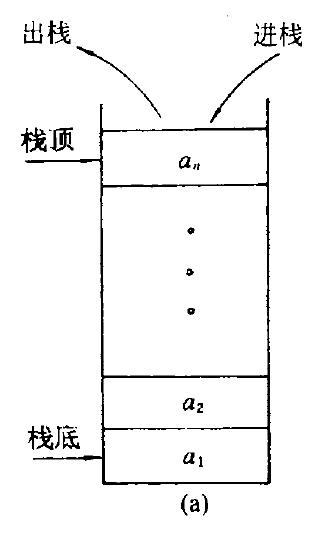
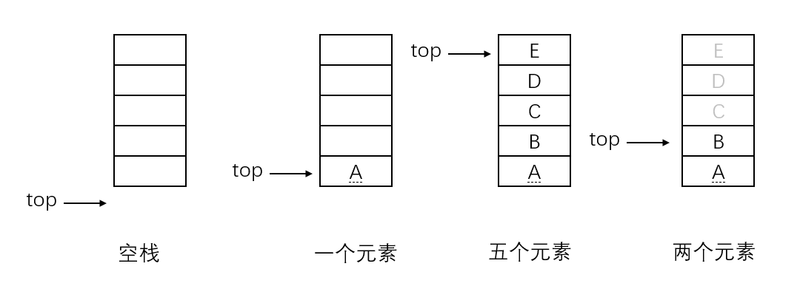
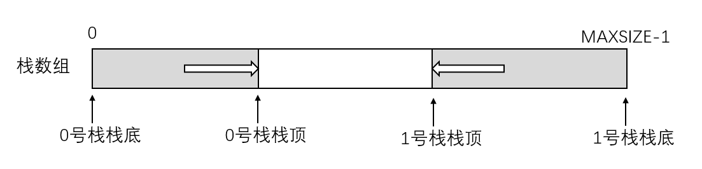
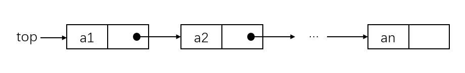
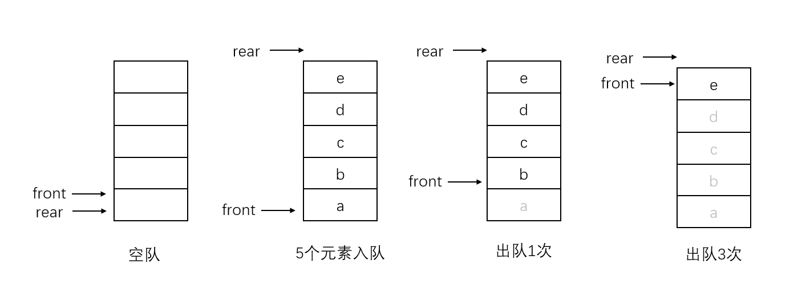

--- 
[注] 本文带 * 的配图均来自  ***[数据结构(C语言版)].严蔚敏 吴伟民***
## 栈
--- 
### 基本概念
**栈(stack)**： 只允许在一端进行插入或删除操作的线性表。示意图（*）如下：  
  

**栈顶(top)**：线性表允许进行删除和插入的一端。  
**栈底(bottom)**：固定的，不允许进行插入和删除的一端。  
**空栈**：不含任何元素的空表。  

上图中a1为栈底元素，an为栈顶元素。进栈次序为： a1->a2->a3->...->an，而出栈次序为：a(n)->a(n-1)->a(n-2)->...->a1。由此可见，栈的一个明显操作特性为**后进先出(Last In First Out, LIFO)**，故又称后进先出的顺序表。  

#### 基本操作
以下基本操作应熟记：  
```cpp
Stack Init();              //始化一个空栈
bool IsEmpty(stack);       //判断栈是否为空
void Push(data);           //压栈
StkData Pop();             //弹栈
StkData GetTop();          //读栈顶元素
void Clear();              //销毁栈
```

### 栈的顺序存储结构
### 顺序栈的实现
栈的顺序存储成为顺序栈，它是利用一组地址连续的存储单元存放自栈底到栈顶的数据元素，同时附有一个指针(top)指示当前栈顶的位置。  
栈的顺序存储类型可以表示为：  
```cpp
#define MAXSIZE 1024

typedef struct
{
    StkData data[MAXSIZE];
    int top;
}SeqStack;
```
栈顶指针： s.top，初始设置top=-1；  
栈顶元素： s.data[top]；  
压栈操作：栈未满时，栈顶指针先+1，再存入值。  
弹栈操作：栈非空时，先取栈顶元素值，再将栈顶指针-1。  
判空：s.top = -1;  
判满：s.top == MAXSIZE-1；  
栈长：s.top+1；  

  

### 顺序栈的基本运算
栈操作的示意图如上图所示，通过该图应深刻理解栈顶指针以及判空指针为-1的作用。  
下面是顺序栈一些常用操作的c++类实现：  
```cpp
#define MAXSIZE 1024

typedef struct
{
  int value;
}StkData;

class SeqStack
{
  public:		
    ~SeqStack();
    //通过构造函数初始化 
    SeqStack()
    {
      data = new StkData[MAXSIZE];
      //指针初始化为-1使得判空判满操以及压栈弹栈能够统一处理
      top = -1;
    }
    //判空操作 
    bool IsEmpty()
    {
      return top == -1;
    }
    //判满
    bool IsFull()
    {
      return top == MAXSIZE-1;
    } 
    //压栈
    bool Push(StkData e)
    {
      if (IsFull())
        return false;
      //指针先加1再存值 
        data[++top] = e;
        return true; 
    } 
    //弹栈 
    StkData Pop()
    {
      if (IsEmpty())
        return NULL;
      //先取值指针再-1 
      return data[top--];
    }
    //读取栈顶元素而不将栈顶弹出 
    StkData GetTopData()
    {
      if (IsEmpty())
        return NULL;

      return data[top];
    }
    //清空栈
    void Clear()
    {
      data = new StkData[MAXSIZE];
      top = -1;
    }

  private:
    StkData data[MAXSIZE];
    int top;

}; 
```
**[注]：考研中数据结构一般不会使用面向对象的语法，如类Class等，所以这里的SeqStack类仅供参考，重点在于基本操作（类中函数的实现），在考试中不要使用类去做题。**

--- 
### 共享栈
利用栈底位置相对不变的特性，可以让两个顺序栈共享一个一维数据空间，将两个栈的栈底分别设置在共享空间的两端，两个栈顶向共享空间的中间延伸，如下图所示：  


两个栈的栈顶指针都指向栈顶元素，top0=-1时0号栈为空，top1=MAXSIZE时1号栈为空。仅当两个栈顶指针相邻（top1-top0=1）时，判断为栈满。当0号栈压栈时top0先+1再赋值，1号栈压栈时top1先-1再赋值。弹栈则刚好相反。  
共享栈是为了更有效的利用存储空间，两个栈的空间相互调节，只有在整个存储空间被沾满时才发生上溢。其存取数据的时间复杂度为O(1)。

共享栈的代码如下：
```cpp
#define MAXSIZE 2048 
typedef struct
{
  int value;
}StkData;

typedef struct
{
  StkData data[MAXSIZE];
  int ltop;
  int rtop; 
}SStack;

class SStakeUtility
{
  public:
    //初始化共享栈 
    SStack Init()
    {
      SStack sstk;
      sstk.data = new StkData[MAXSIZE];
      sstk.ltop = -1;
      sstk.rtop = MAXSIZE;
      
      return sstk;
    }
    //判左栈空 
    bool IsLeftStackEmpty(SStack sstk)
    {
      return sstk.ltop == -1;
    }
    //判右栈空 
    bool IsRightStackEmpty(SStack sstk)
    {
      return sstk.rtop == MAXSIZE;
    }
    //判栈满
    bool IsFull(SStack sstk)
    {
      return sstk.rtop - sstk.ltop == 1;
    } 
    //清空共享栈
    void Clear(SStack& sstk)
    {
      delete sstk.data;
      sstk.ltop = -1;
      sstk.rtop = MAXSIZE;
    } 
    
    //左栈压栈
    bool PushLeft(SStack& sstk, StkData e)
    {
      if (IsFull(sstk))
          return false;
          
        sstk.data[++sstk.ltop] = e;
        return true;
      } 
      //左栈弹栈
    StkData PopLeft(SStack& sstk)
    {
      if (IsLeftStackEmpty(sstk))
          return NULL;
    
            return sstk.data[sstk.ltop--];
      } 
      //取左栈栈顶元素而不弹栈
    StkData GetLeftTop(SStack sstk)
    {
      if (IsLeftStackEmpty(sstk))
          return NULL;
    
            return sstk.data[sstk.ltop];
    } 
    //清空左栈
      void ClearLeft(SStack& sstk)
      {
        sstk.ltop = -1;
    }
      
      //右栈压栈
    bool PushRight(SStack& sstk, StkData e)
    {
      if (IsFull(sstk))
          return false;
          
        sstk.data[--sstk.rtop] = e;
        return true;
      } 
      //右栈弹栈
    StkData PopRight(SStack& sstk)
    {
      if (IsLeftStackEmpty(sstk))
          return NULL;
    
            return sstk.data[sstk.rtop++];
      } 
      //取右栈栈顶元素而不弹栈
    StkData GetLeftTop(SStack sstk)
    {
      if (IsLeftStackEmpty(sstk))
          return NULL;
    
            return sstk.data[sstk.rtop];
    } 
    //清空右栈
    void ClearLeft(SStack& sstk)
    {
      sstk.rtop = MAXSIZE;
    }
};
```

--- 
### 栈的链式存储结构 
采用链式存储的栈称为链栈，链栈的优点是便于多个栈共享存储空间和提高效率，且不存在栈满上溢的情况。  
通常链栈采用单链表实现，并规定所有操作都是在单链表的表头进行的。规定链栈没有头结点，只有栈顶指针。如下图所示：  
 

--- 
因为链栈的实现就是链表，只是在操作上有所不同，这里只给出链栈的基本操作代码，不对其进行详细讨论。  
```cpp
typedef struct 
{
  int value;
}StkData;

typedef struct StkNode
{
  StkData value;
  struct StkNode *next;
}StkNode, *pStkNode;

class Stack : public
{
public:
  //初始化
  void Stack()
  {
    top = NULL;
  }
  //读取头结点
  pStkNode GetTop()
  {
    pStkNode tmpHead = top;
    return tmpHead;
  }
  //判空
  bool IsEmpty()
  {
    return top == NULL;
  }
  //压栈
  bool Push(StkData data)
  {
    pStkNode n = new pStkNode;
    n->data = data;
    n->next = top;
    top = n;
    return true;
  }
  //弹栈
  pStkNode Pop()
  {
    if (IsEmpty())
      return NULL;
    
    pStkNode tmp = top;
    top = top->next;
    return tmp;
  }
  //清空栈
  void Clear()
  {
    while (top)
    {
      pStkNode tmp = top->next;
      delete top;
      top = tmp;
    }
    
    top = NULL;
  }
private:
  pStkNode top;
}
```
--- 
## 队列

--- 
### 定义
队列（queue）简称队，也是一种操作受限的线性表，只允许在表的一端进行插入，另一端进行删除。在队列中插入元素称为入队，删除元素称为离队。操作特性是**先进先出（First In First Out，FIFO）**，故又称先进先出的线性表。示意图（*）如下：  


### 常见基本操作  
```cpp
Queue Init();                           //初始化一个空队列
bool IsEmpty(Queue q);                  //判空
void Enqueue(Queue& q, QueueData e);    //入队
QueueData Dequeue(Queue& q);            //出队
QueueData GetHead(Queue& q);            //获取对头元素而不出队
```

### 队列的顺序存储结构 
队列的顺序实现是指分配一块连续的存储单元存放队列中的元素，并附有两个指针front和rear分别指示队头元素和队尾元素的位置。  

队列的顺序存储类型可描述为：  
```cpp
#define MAXSIZE 1024

typedef struct
{
  int value;
}QueueData;

typedef struct
{
  QueueData datas[MAXSIZE];
  int front;
  int rear;
}SeqQueue;
```
初始条件（判空条件）：q.front == q.rear == 0;  
入队条件：队不满时，先赋值再将队尾指针+1。  
出队条件：队非空时，先移出元素再将队头指针-1。

  

> 注意：不能用q.rear == MAXSIZE来判断队列是否已满，因为如上图所示，第四种情况下，q.rear==MAXSIZE成立，但是队列中仅有一个元素，这时入队出现“上溢出”，但是不是真正的溢出。这是顺序队列的缺点。  

### 循环队列 


---  
<center>  
 <a href="../entranceExamSummary">返回目录</a>
</center>