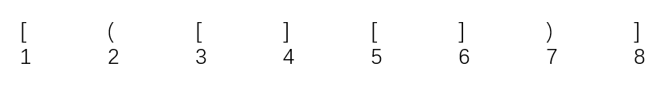
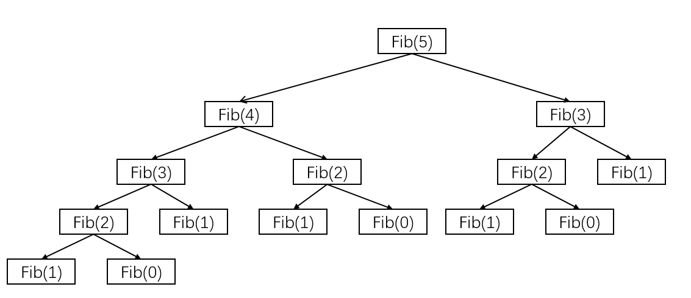
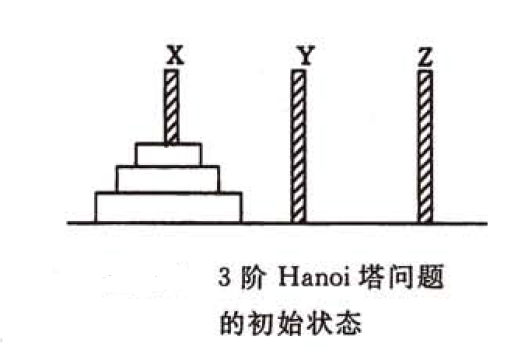
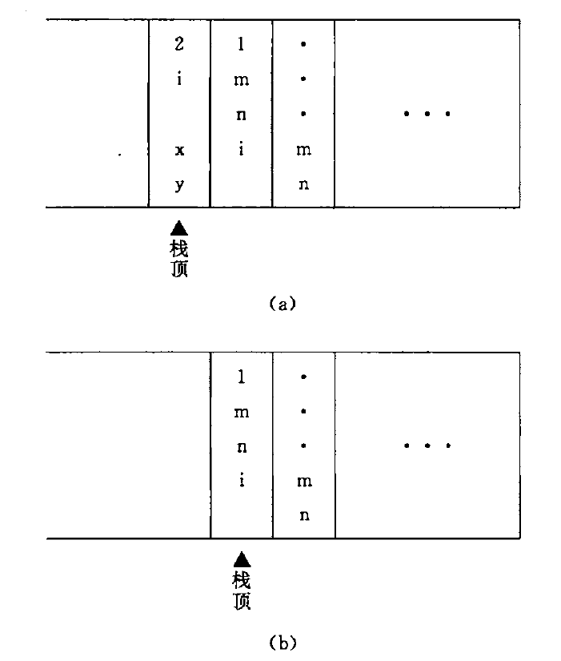

--- 
[注] 本文带 * 的配图均来自  ***[数据结构(C语言版)].严蔚敏 吴伟民***

> 快速导航  
> [1. 栈在括号匹配中的应用](#brackets)  
> [2. 栈在表达式求值中应用](#formula)  
> [3. 栈在递归中的应用](#recursive)  
> [4. 队列在层次遍历中的应用](#layer)  
> [5. 随机事件模拟](#randomeventremote)

--- 
<h3 id="brackets"> 栈在括号匹配中的应用</h3>
假设表达式中允许包含两种括号：圆括号和方括号，其嵌套的顺序任意，即( [ ] ( ))或[([][])]等均为正确的格式，[(])或([()或者(()]均为不正确的格式。  
考虑以下括号序列:



分析如下：
1. 计算机接收到第1个括号“[”后，期待与之匹配的第8个括号“]”出现。  
2. 获得了第2个括号“(”，此时第1个括号“[”暂时放在一边，而急迫期待与之匹配的第7个括号“)”的出现。  
3. 获得了第3个括号“[”，此时第2个括号“(”暂且放在一边，而急迫期待与之匹配的第4个括号“]”的出现。第3个括号的期待得到满足，消解之后，第2个括号的期待匹配又成为当前最急迫的任务了。  
4. 依次类推，可见该过程的处理与**栈**的思想吻合。  

算法的思想如下：  
1. 初始设置一个空栈，顺序读入括号。  
2. 若是右括号，则或者使置于栈顶的最急迫期待得以消解，或者是不合法的情况（括号序列不匹配，退出程序）。  
3. 若是左括号，则作为一个新的更急迫的期待压入栈中，自然使原有的在栈中的所有未消解的期待的急迫性降了一级。算法结束时，栈为空，否则括号序列不匹配。  

下面通过一道题目来对这种情况进行详细说明：  

题：假设一个算术表达式中包含圆括号"()"、方括号"[]"和花括号"{}"3种类型的括号，编写一个算法来判别表达式中的括号是否配对，以字符“\0”作为算术表达式的结束符。  

分析：与上文所提到的一致，本题采用栈的思路来解决。  
基本思想是扫描每个字符，遇到左括号进栈，遇到右括号时检查栈顶元素是否是相对应的左括号，若是则弹栈，否则匹配错误。最后的栈如果不为空也为匹配错误。
下面给出一个可运行的代码，为了强调本题思路，所使用的栈非手动实现而使用了C++中STL的stack数据结构。  
```cpp
//一个可运行的非常容易理解的版本
#include <iostream>
#include <stack>
#include <cstring>
using namespace std;

int main()
{
    char str[1024];
    stack<char> s;
    cin>>str;

    for(int i=0; i<strlen(str); i++)
    {
        if (str[i]=='(' || str[i]=='[' || str[i]== '{')
            s.push(str[i]);
        else if (str[i]==')' || str[i]==']' || str[i]== '}')  
        {
            if (s.empty())
            {
                cout<<"error"<<endl;
                exit(0); 
            }
            switch(str[i])
            {
                case ')':
                    if (s.top() == '(')
                        s.pop();
                    else
                    {
                        cout<<"error"<<endl;
                        exit(0); 
                    }
                    break;
                case ']':
                    if (s.top() == '[')
                        s.pop();
                    else
                    {
                        cout<<"error"<<endl;
                        exit(0); 
                    }
                    break;
                case '}':
                    if (s.top() == '{')
                        s.pop();
                    else
                    {
                        cout<<"error"<<endl;
                        exit(0); 
                    }
                    break;
                default: break;
            }		
        } 
    }
    if (!s.empty())
    cout<<"error"<<endl;
    else
    cout<<"success"<<endl;  

    return 0;
} 

//一个更加精简的版本，仅提供方法
bool BracketsCheck(char *str)
{
    stack<char> s;
    int i=0;
    
    while(str[i] != '\0')
    {
        switch(str[i])
        {
            case '(': s.push(str[i]); break;
            case '[': s.push(str[i]); break;
            case '{': s.push(str[i]); break;
            
            case ')': 
                char tmp = s.pop();
                if (tmp != '(')
                    return false;
                break;
            case ']': 
                char tmp = s.pop();
                if (tmp != '[')
                    return false;
                break;
            case '}': 
                char tmp = s.pop();
                if (tmp != '{')
                    return false;
                break;
        }
        i++;
    }

    return s.empty();
}
```

--- 
<h3 id="formula"> 栈在表达式求值中的应用</h3>
表达式求值是程序设计语言编译中的一个最基本的问题，它的实现是栈应用的一个典型范例。  

下面介绍几个概念（这是我所理解的概念，非严谨概念）：
+ 中缀表达式  
   运算数和操作符依次出现的表达式。中缀表达式不仅需要考虑运算符优先级，还需要考虑括号。如a+b×(c-d)-e/f。   
+ 后缀表达式  
   操作符出现在运算数之后且考虑了优先级的表达式。由于考虑了优先级，所以没有括号。如上式中的中缀表达式可化为abcd-×+ef/-

下面介绍一个简单直观、广为使用的算法，通常称为**“算符优先法”**。  
要把一个表达式翻译成正确求值的一个机器指令序列，或者直接对表达式求值，首先要能够正确解释表达式。例如，要对下面的算术表达式求值：  
<center>4+2×3-10/5</center>  
首先要了解算数四则运算的规则。即：    

1. 先乘除，后加减；
2. 从左往右算；
3. 先括号内，后括号外。

由此，这个算术表达式的计算顺序应为：  
<center>4+2×3-10/5 = 4+6-10/5 = 10-10/5 = 10-2 = 8</center>  
算符优先法就是根据这个运算优先关系的规定来实现对表达式的编译或解释执行的。  

任何一个表达式都是由操作数（operand）、运算符（operator）和界限符（delimiter）组成的，我们称它们为单词。一般的，操作数既可以是常数也可以是被说明为变量或常量的标识符；运算符可以分为算术运算符、关系运算符和逻辑运算符三类；基本界限符有左右括号和表达式结束符等。

这里仅讨论简单算术表达式（只包含加减乘除）的求值问题。  
将运算符和界限符统称为算符，用集合OP来表示。在运算的每一步中，任意两个相继出现的算符θ1、θ2之间的优先关系至多是下面三种关系之一。
* θ1 < θ2 ： θ1的优先权低于θ2
* θ1 = θ2 ： θ1的优先级等于θ2
* θ1 > θ2 ： θ1的优先级高于θ2   

下表展示了这种运算优先级的关系：  
  
值得注意的地方时，由于上面的运算规则3，所以表中的“+、-、/、*”运算的优先级均低于左括号，但高于右括号。由运算规则2，当两个相同运算符匹配时，令θ1>θ2。当左右括号相遇时，代表括号内运算已经完成，为了方便，表达式最左侧与最右侧均自动填充一个“#”字符来代表表达式的范围，当两个“#”相遇时，表明整个表达式已经计算完毕。假设输入的表达式不会包含语法错误，所以上表中“)”和“(”，“(”和“#”等无优先级关系。

算法的基本思想如下：  
使用两个工作栈，一个用于寄存运算符（称之为OPTR），一个用于寄存操作数或运算结果（称为OPND）。  
首先置OPND为空栈，表达式起始符“#”为OPTR的栈底元素。  
依次读入表达式中的每个字符，若是操作数则进OPND栈，若是运算符则和OPTR的栈顶运算符比较优先级后进行相应操作，直至整个表达式求值完毕（OPTR的栈顶元素和当前读入的字符均为“#”）。

下面的代码给出了这种思路的基本实现。
```cpp

OPNDType EvaluateExpression()
{
    stack<OPTRType> optr;
    stack<OPNDType> opnd;

    optr.push('#');
    c = getchar();
    while(c != '#' || optr.top() != '#')
    {
        if (!IsOp(c))
        {
            opnd.push(c);
            c = getchar();
        }
        else 
        {
            switch(CmpOp(c,optr.top()))
            {
                case '<':
                    optr.push(c);
                    c = getchar();
                    break;
                case '=':
                    optr.pop();
                    c = getchar();
                    break;
                case '>':
                    OPTRType theta = optr.pop();
                    OPNDType a = opnd.pop();
                    OPNDType b = opnd.pop();
                    opnd.push(GetResult(a, theta, b));
                    break;
            }
        }
    }
    return opnd.top();
} 

//其中  
bool IsOp(char );   //判断输入的参数是否为操作符  
char CmpOp(char ,OPTRType );    //比较运算符优先级，返回值为/</>/=  
OPNDType GetResult(OPNDType, OPTRType, OPNDType);   //返回两个数与一个运算符的计算结果
```
本问题也可以只用一个栈来解决，其基本思路与上文完全一致，不同的地方在于输入的时候需要将表达式转化为后缀表达式后再输入。

---  
<h3 id="recursive">栈在递归中的应用</h3>  

**递归**是一种重要的设计方法。  
如果在一个函数、过程或数据结构的定义中又应用了它自身，那么称为递归。  

递归通常把一个大型的复杂问题，层层转化为一个与原问题相似的规模较小的问题来求解，递归策略通常只需要少量的代码就可以描述出解题过程中所需要的多次重复计算，大大地减少了程序的代码量。  
**但是在通常情况下效率不是太高**。  

以斐波那契数列为例，其定义为   
```
         ┌ fib(n-1) + fib(n-2)   n>1
fib(n) = ┼ 1                     n=1
         └ 0                     n=0
```
这就是递归的一个典型例子，用程序来实现如下： 
```cpp
int fib(n)
{
	if (n == 0)
	   return 0;                        //边界条件
	if (n == 1)
	   return 1;                        //边界条件
	
	return fib(n-1) * fib(n-2);   	    //递归表达式
} 

```
必须注意递归模型不能是循环定义的，其必须满足下面两个条件：  
+ 递归表达式（递归体）。  
+ 边界条件（递归出口）。

**递归的精髓在于能否将原始问题转化为属性相同但规模较小的问题。**  
在递归调用的过程中，系统为每一层的返回点、局部变量、传入实参等开辟了递归工作栈来进行数据存储，递归次数过多容易造成栈溢出等。而其效率不高的原因是递归调用过程中包含很多重复的计算。  

计算斐波拉契数列前5项调用执行如下图：  


由图可知，在调用过程中，fib(3)倍计算了2次，fib(2)被计算了3次。fib(1)被计算了5次，fib(0)被计算了3次。所以，递归的效率低下。  
上方的斐波拉契数列是因为数学公式直接是递归定义的，有些数据结构，如二叉树、广义表等，由于结构本身固有的递归特性，他们的操作可递归描述，还有一类问题，虽然问题本身没有明显的递归结构，但是用递归求解比迭代求解更加简单，如八皇后问题和汉诺塔问题。  
下面以这hanoi问题为例更加详细的讲述一下递归：  

【例】（n阶Hanoi塔问题）假设有3个分别命名为X、Y和Z的塔座，在塔座X上插有n个直径大小各不相同、依小到大编号为1,2,...,n的圆盘。现要求将X塔上的n个圆盘移至Z上并仍按同样的顺序叠排，圆盘移动时必须遵循以下规则：  
1. 每次只能移动一个圆盘；
2. 圆盘可以插在X、Y和Z的任一塔座上；
3. 任何时候都不能将一个较大的圆盘压在较小的圆盘之上。

下图（*）描述了3阶汉诺塔问题的初始状态：  


如何实现圆盘的操作呢？  
这里可以从简单的操作入手，如果n=1的情况下会是怎样的？  
很明显，如果只有一个圆盘，就不需要借助辅助塔，直接将圆盘从x移至z就可以了。用递归的思想去想，这一步就可以作为递归出口。再想一下如果n=2的情况下，这时候就需要辅助塔了。具体操作室先将1号圆盘拿到y上（此时z做辅助塔），再将2号圆盘拿到z上（此时y做辅助塔），接着将在y上的1拿到z上完成整个操作。拓展开来，如果是n和n-1这两种情况，n和n-1能不能转化呢？答案当然是肯定的，在n的情况下，如果能设法将n-1拿到y上，n就可以拿到z上了，也就是大的可以转化为小的，这正是递归思想。  
使用c语言将整个过程表述如下：  
```cpp
int c = 0;

void move(char x,int n,char z)
{
    printf("%-4d. move disk %2d from %c to %c\n", ++c,n,x,z);
}

void hanoi(int n,char start,char support,char aim)
{
    if (n == 1)
        move(start,n,aim);
    else
    {
        hanoi(n-1,start,aim,support);
        move(start,n,aim);
        hanoi(n-1,support,start,aim);
    }   
}
```
可以将递归算法转换为非递归算法，这种情况下通常需要借助栈来实现这种转化。  

那么在计算机内是如何执行的呢？先看任意两个函数之间进行调用的情形。  
**在高级语言编制的程序中，调用函数和被调用函数之间的链接及信息交换需要通过栈来进行。**  
通常，当在一个函数的运行期间调用另一个函数时，在运行被调用函数之前，系统需要完成三件事：
1. 将所有的实参、返回地址等信息传递给被调用函数保存；
2. 为被调用函数的局部变量分配存储区；
3. 依照被调用函数保存的返回地址将控制转移到调用函数。  
当有多个函数构成嵌套调用时，按照“后调用先返回”的原则，上述函数之间的信息传递和控制转移必须通过栈来实现，即系统将整个程序运行时所需的数据空间安排在一个栈中，每当调用一个函数时，就为它在栈顶分配一个存储区，每当从一个函数退出时，就释放它的存储区，则当前正运行的函数的数据区必在栈顶。  
例如，在如下函数中：  

```c
void first(int ,int );
void second(int );

int main()
{
    int m, n;
    ...
    first(m, n);
    ...
    return 0;
}

void first(int a,int b)
{
    int i;
    ...
    second(i);
    ...
}

void second(int a)
{
    int x, y;
    ...
}
``` 

主函数中调用了first函数，在first函数中调用了second函数。则下图a（*）展示了当前正在执行函数second中的某个语句时的栈的状态，而下图b（ *）则展示了从函数second退出之后正执行first中某个语句时栈的状态（图中以语句标号表示返回地址）。  


一个递归函数的运行过程类似于多个函数的嵌套调用，只是调用函数和被调用函数是同一个函数，因此，和每次调用相关的一个重要概念是递归函数运行的“层级”。假设调用改递归函数的主函数为第0层，则从主函数调用递归函数进入第1层，从第i层递归调用本函数为进入“下一层”，即第i+1层。相反，退出第i层递归应返回“上一层”，即i-1层。为了保证递归函数正确执行，系统需要设立一个“递归工作栈”作为整个递归函数运行期间使用的数据存储区。每一层递归所需信息构成一个“工作记录”，其中包括所有的实参、所有的局部变量以及上一层的返回地址。没进入一层递归，就产生一个新的工作记录压入栈顶。每退出一层递归，就从栈顶弹出一个工作记录，则当前执行层的工作记录必是递归工作栈的工作记录，称这个记录为“活动记录”，并称指示活动记录的栈顶指针为“当前环境指针”。

---
<h3 id="layer">队列在层次遍历中的应用</h3>
在信息处理中有一大类问题需要逐层或逐行处理，这类问题的解决方法往往是在处理当前层或当前行时就对下一层或者下一行进行预处理，把处理顺序安排好，待当前层或者当前行处理完毕，就可以处理下一层或者下一行。   
使用队列是为了保存下一步的处理顺序。下面用二叉树层次遍历来说明队列这一应用。  

假设有如图所示的二叉树：
  
下面的代码显示了层次遍历二叉树的过程：  
```cpp
void foreachDoubleTree(DTree t)
{
    Queue q;
    q.Enqueue(t.root);

    while (q.IsEmpty())
    {
        DTreeNode node = q.Dequeue();
        cout<<node.value;

        if (node.leftChild != NULL)
            q.Enqueue(node.leftChild);
        if (node.rightChild != NULL)
            q.Enqueue(node.rightChild);    
    }
    cout<<endl;
}
```
该过程的简单描述如下：
1. 根结点入队。
2. 若队空，则结束遍历；否则重复3操作。
3. 队列中的第一个结点出队并访问，若其有左孩子，则将左孩子入队；若其有右孩子，则将右孩子入队，返回2操作。

--- 
<h3 id="randomeventremote">离散事件模拟</h3>

这里通过一个银行业务模拟来介绍离散事件的模拟。  
假设某银行有4个窗口对外接待客户，从早晨银行开门起不断有客户进入银行。由于每个窗口在某个时刻只能接待一个客户，因此在客户人数众多时需在每个窗口之前顺次排队，对于刚进入银行的客户，如果某个窗口的业务员正空闲，则可上前办理业务，反之，若4个窗口均有客户，便会排在人数最少的队伍后面。现在需要编制一个程序以模拟银行的这种业务活动并计算一天中客户在银行逗留的平均时间。  
为了计算这个平均时间，需要记录客户到达银行和离开银行的时间，所有客户逗留时间的总和被一天内进入银行的客户数除便是所求的平均时间。  
称客户到达银行和离开银行这两个时刻发生的事情为**事件**，则整个程序将事件发生的先后顺序进行处理，这样一种模拟程序称为**事件驱动模拟**。  
下面的代码正是这个事件的简单模拟程序：
```c
void BankSimulation(int closeTime)
{
    //初始化
    OpenForDay();
    while(moreEvent)
    {
        //事件驱动
        EventDrived(occurTime, eventType);
        //处理事件
        switch(eventType)
        {
            case "Arrived":
                CustomerArrived();
            break;
            case "Departure":
                CustomerDeparture();
            break;
        }
    }
    //计算平均逗留时间
    CloseForDay();
}
```

下面讨论模拟程序的详细实现，首先要讨论模拟程序中所需要的数据结构及其操作。  
这个程序中主要处理的是“事件”，事件的主要信息是事件类型和事件发生的时间。算法中处理的事件有两类：一类是客户到达事件，一类是客户离开事件。  
前一类事件发生时刻随客户到来后自然形成，后一类事件发生时刻则由客户事务所需要的时间和等待时间而定。由于程序驱动是按事件发生时刻的先后顺序进行，则时间表应该是有序表，其主要操作是插入和删除。  
另一种数据结构是表示客户排队的队列，由于前面假设银行有4个窗口，因此程序中需要4个队列，队列中有关客户的主要信息是客户到达的时刻和客户办理事务所需要的时间。每个队列中的队头为正在办理事务的客户，他办理完事务离开队列的时刻就是即将发生的客户离开事件的时刻，这就是说，对每个队头客户都存在一个将要驱动的客户离开事件。因此，在任何时刻即将发生的事件只有以下5种可能：  
1. 新客户到达；
2. 1号窗口客户离开；
3. 2号窗口客户离开；
4. 3号窗口客户离开；
5. 4号窗口客户离开。

所以，这个模拟程序中只需要两种数据类型：有序链表和队列。数据元素类型分别定义如下：  
```c
typedef struct
{
    int occurTime;  //发生时刻
    int type;       //事件类型0代表到达，1-4代表1-4号窗口离开
}Event, EventNode, *pEventNode;

//事件链表类型，定义为有序链表
typedef LinkList EventList

typedef struct
{
    int arrivalTime;    //到达时刻
    int duration;       //办理业务持续时间
}QueueNode, *pQueueNode;
```
程序中使用随机数来模拟客户到达时间，假设第一个客户进门的时刻是0，即是模拟程序处理的第一个事件，之后每个客户到达的时刻在前一个客户到达时判定。因此在客户到达事件发生时需产生两个随机数，其一为到达客户办理事务所需时间duration，其二为下一客户到达时间间隔interTime，假设当前事件发生的时刻为occurTime，则下一个客户到达事件发生的时刻为occurTime+interTime。由此应产生一个新的客户到达事件插入事件表，刚到达的客户则应插入到当前所含元素最少的队列中，若该队列在插入前为空，则还应产生一个客户离开事件插入事件表。  
客户离开事件的处理比较简单，首先计算该客户在银行的逗留时间，然后从队列中删除该客户后查看队列是否为空，若不为空则设定一个新的队头客户离开事件。  
完整的示例代码如下：
```c
#define WINDOWCOUNT 4

EventList ev;   //事件表
Event en;       //事件
LinkQueue q[WINDOWCOUNT];   //客户队列
QueueNode customer;         //客户记录
int totalTime, customerNum; //累计客户逗留时间，客户数

int Cmp(Event a, Event b)
{
    int tmp = a.occurTime - b.occurTime;
    if (tmp > 0)
        return 1;
    else if (tmp < 0)
        return -1;
    else
        return 0;
}

void OpenForDay()
{
    totalTime = 0;
    customerNum = 0;
    InitList(ev);
    
    en.occurTime = 0;
    en.type = 0;
    
    OrderInsert(ev, en, Cmp);

    for (int i = 0;i < WINDOWCOUNT; i++)
        InitQueue(q[i]);
}

void CustomerArrived()
{
    ++customerNum;
    int d, it;
    int &durTime = d, &interTime = it;

    Random(durTime, interTime);
    int t = en.occurTime + interTime;

    if (t < closeTime)
        OrderInsert(ev, new Event(t,0), (*Cmp)());
    
    int i = Minimum(q);
    q[i].enqueue(en.occurTime, duration);

    if (q[i].length == 1)
        OrderInsert(ev, new Event(en.occurTime+durTime, i), (*Cmp)());
}

void CustomerDeparture()
{
    int i = en.type;
    customer = q[i].dequeue();

    totalTime += en.occurTime - customer.arrivalTime;

    if (!q[i].IsEmpty())
    {
        customer = q[i].GetHead();
        OrderInsert(ev, new Event(en.occurTime + customer.duration, i), (*Cmp)());
    }
}
void CloseForDay()
{
    printf("The average time is %f\n", (float)totalTime/customerNum);
}

void BankSimulation(int closeTime)
{
    //初始化
    OpenForDay();

    while(!ev.IsEmpty())
    {
        Event e, &p = e;
        ev.Delete(ev.head, p);
        en = GetCurrentEvent(p);

        if (en.type == 0)
            CustomerArrived();
        else
            CustomerDeparture();
    }

    CloseForDay();
}

```


---