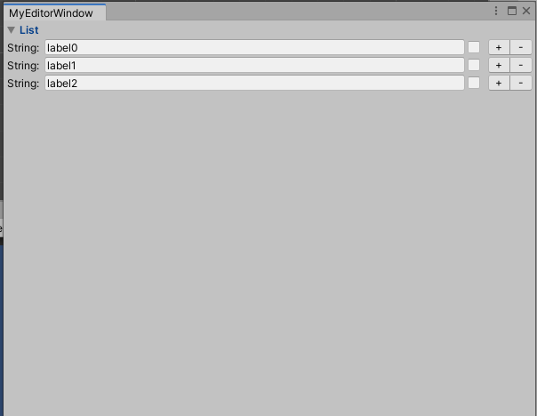
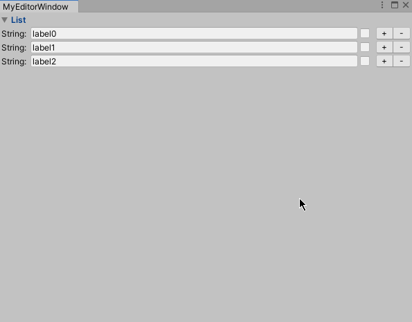

---
## 遇到的问题

假设这样一个场景，在Unity中，你自己编写了一个EditorWindow用于创建一些一行一行的文本配置，其数据结构如下：
```csharp
[Serializable]
public class MyClass
{
    public string label = string.Empty;
    public bool enable = false;
}
```
同时存在一个编辑窗口，用于显示一个List<MyClass>方便策划编辑，该Window界面如下：


我们要实现的功能是点击每一行数据后方的两个按钮来在该行数据位置添加新数据与删除该位置的数据，删除操作非常简单，在此略过，现在我们来讨论添加操作，并且引出我们的问题：

**如何在点击“+”按钮后把焦点自动设置为新增加的那一行数据的文本输入栏？**

换句话说，如何实现下图的效果？



---
## 解决方案
在解决此方案之前，首先要明确Unity对Inspector上的所有控件的定义，在Inspector上的所有控件称为“**Control**”，每个Control拥有一个唯一的**ControlID**与**ControlName**。

那么如何去获取当前焦点所对应的ControlID呢？通过查阅API文档得知，我们可以使用```EditorGUIUtility.hotControl```来获取到当前/上一焦点所对应的Control的ControlID，同样的，我们可以通过```EditorGUIUtility.GetControlID```来获取一个唯一的可分配的controlID，API文档中对此方法的注释为
```
Get a unique ID for a control, using an integer as a hint to help ensure correct matching of IDs to controls.
```

同时，我们对焦点的控制可以直接操作EditorGUIUtility.hotControl属性。

新的问题来了，我们如何去获取某一特定Control的ControlID呢？

很遗憾，目前我没有找到完全可行的方法，但是通过观察hotControl我发现，其ID对应面板上是按照从上至下，从左至右依次递增的规律分配的。利用这个规律，我们就可以推算出一个大概的数字来对ControlID实行手动控制了。

那么是不是就只有这样一种办法了呢？

显然，不是。对于文本输入Control（即对应TextField或者TextArea）来说，我们可以使用```EditorGUI.FocusTextInControl(string name)```方法来实现手动定位，此方法在API文档中给出的注释为
```
Move keyboard focus to a named text field and begin editing of the content.
```

这样显然是满足需求了。但是新的问题又来了，如何去确定/分配每个Control的ControlName呢？

继续查阅API文档得知，我们可以通过```GUI.SetNextControlName(string name)```方法来给下一个绘制的Control分配ControlName。

文档查到这里，就可以关掉了，已知的条件已经完全可以满足我们的需求了。

其主要思路如下：

1. 在遍历List时，对每一个TextField分配一个自定义的ControlName
2. 在点击“+”按钮时指定下一次刷新时焦点所对应的Name
3. 在下一个刷新时，将焦点指定为在第2步中所设置的Name的Control

经历这些步骤，我们可以迅速完成编码，其Window代码如下：
```csharp
//ORG: Ghostyii & MOONLIGHTGAME
using System;
using System.Collections.Generic;
using UnityEditor;
using UnityEngine;

public class MyEditorWindow : EditorWindow
{
    private bool foldout = true;
    private string ctrlName = string.Empty;
    private List<MyClass> myList = new List<MyClass>();

    private void OnEnable()
    {
        if (myList.Count == 0)
            for (int i = 0; i < 3; i++)
                myList.Add(new MyClass() { label = string.Format("label{0}", i) });
    }

    private void OnGUI()
    {       
        foldout = EditorGUILayout.BeginFoldoutHeaderGroup(foldout, "List");
        if (foldout)
        {
            for (int i = 0; i < myList.Count; i++)
            {
                var item = myList[i];
                EditorGUILayout.BeginHorizontal();
                EditorGUILayout.LabelField("String:", GUILayout.Width(40));

                GUI.SetNextControlName("id" + i);

                item.label = EditorGUILayout.TextField(item.label, GUILayout.Width(position.width - 125));
                item.enable = EditorGUILayout.Toggle(item.enable, GUILayout.Width(20));

                if (GUILayout.Button("+", EditorStyles.miniButtonLeft, GUILayout.Width(25)))
                {
                    myList.Insert(i, new MyClass() { label = "new label" });
                    ctrlName = "id" + i;
                    //已经对list作出改动，本次刷新无需再遍历list，使用break跳出循环
                    EditorGUILayout.EndHorizontal();
                    break;
                }

                if (GUILayout.Button("-", EditorStyles.miniButtonRight, GUILayout.Width(25)))
                {
                    myList.RemoveAt(i);
                    //已经对list作出改动，本次刷新无需再遍历list，使用break跳出循环
                    EditorGUILayout.EndHorizontal();
                    break;
                }

                EditorGUILayout.EndHorizontal();
            }

            if (!string.IsNullOrEmpty(ctrlName))
            {
                EditorGUI.FocusTextInControl(ctrlName);
                ctrlName = string.Empty;
            }
        }
        EditorGUILayout.EndFoldoutHeaderGroup();        
    }

    [MenuItem("Tools/MyWindow")]
    private static void OpenWindow()
    {
        MyEditorWindow window = CreateWindow<MyEditorWindow>();
        window.Show();
    }
}
```

至此，问题解决。

---
