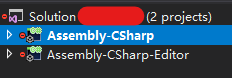

---
## 引言
对于Editor脚本，每个Unity的开发者都会需要掌握一些基本的用法。而且对于Unity编辑器本身，几乎所有的mono脚本/ScriptObject脚本都是拥有自身的Editor脚本用于自定义绘制Inspector上的属性。

通常情况下，开发者只需要使用继承自Editor的子类并且标注CustomEditor特性即可实现自己的Editor脚本，但是在某些特殊情况下，我们需要拓展Unity原有的脚本，如果直接继承Editor并且调用base.OnInspectorGUI方法，常常会造成原有布局的紊乱。

本文将对这种情况介绍对应的解决方案。

## 针对早期版本
在Unity的早期版本中（此处说的早期版本指的是2017.3之前的版本），Unity工程中的vs Solution只会创建一个project，也就是Editor不会单独成为一个project，在这种情况下，用户并不能够去直接继承对应mono脚本的Editor脚本。

早期版本中，如果要不影响原有布局来实现新增属性，<a href="https://www.xuanyusong.com/archives/3931" target="_blank">Unity3D研究院编辑器之不影响原有布局拓展Inspector（二十四）</a>，雨松大大的这篇博客指出了一种方法，其原理是利用反射去获取对应mono脚本中的OnInspector方法来实现对原有布局的拓展。

这种方法是可行的，但是对于开发者来说，需要多一个脚本去控制，且需要使用这种布局的Editor脚本需要继承这个特定的Editor基类。

这种办法并不算是很方便。

## 针对新版本
此处的新版本指的是从Unity2017.3开始的版本，在这些版本的Unity中，Unity的工程会被分成两个project，分别是Unity项目本身的project与独立出来的Editor project，如下图所示：



同时发生变化的还有Unity项目的Library\UnityAssemblies文件夹中会比之前的版本多出很多的动态库。

这样对于开发者来说，优点就是Editor拓展开发更加方便，不太好的一点是不能再把Editor文件夹下的Editor脚本与unity C# script里的Editor类进行无缝衔接了（毕竟在早期官方放出的一些示例项目中就有把Editor脚本与Unity C#脚本写在一个文件内的先例）。

在这样的结构下，要去保留原有布局就非常简单了，拿一个RectTransform的例子来说，我们需要改动的地方不再是要去编写一个抽象类去反射Unity自身的Editor脚本，而是可以在引用中直接找到该Editor脚本的引用了。这样我们便可以直接继承该脚本，就如同C#脚本中直接继承需要拓展的类一样。

```csharp
//ORG: Ghostyii & MOONLIGHTGAME
using UnityEngine;
using UnityEditor;
using UnityEditor.UI;

public class MyRectTransformEditor : RectTransformEditor
{
    protected override OnEnable()
    {
        base.OnEnable();
        //DO YOUR THINGS
    }

    protected override OnInspectorGUI()
    {
        base.OnInspectorGUI();
        //DO YOUR THINGS

        //EXAMPLE
        if (GUILayout.Button("New Button"))
        {
            //TODO
        }
    }
}

```

代码如上所示，依照此方法去实现，效果是一样的且更加方便。

## 早期版本的捷径
其实对于早期版本而言，也可以采用新版本的方式来做这样的事情，方法同样也不复杂，只需要在Unity的安装目录下找到对应的动态库，放入Unity工程的Assets文件夹下即可。譬如UGUI的Editor动态库链接为：
```
your unity install path\Editor\Data\UnityExtensions\Unity\GUISystem\Editor\UnityEditor.UI.dll
```

然后方法就与上文中新版本方法是一样的了。

值得注意的是，新版本中采用这个方法会出现两个相同的动态库，Unity会报出一大堆警告。所以还是不要尝试了，毕竟没有必要。

---