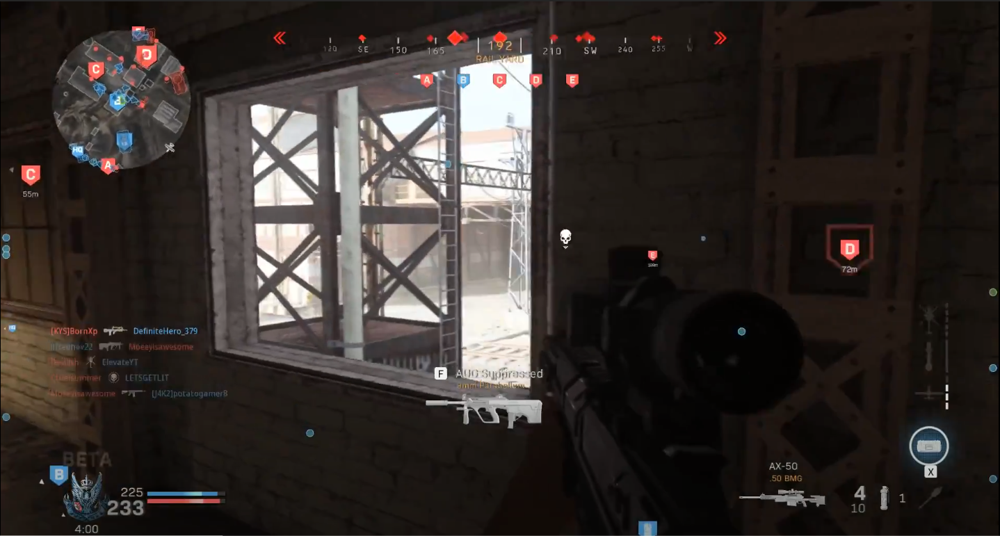
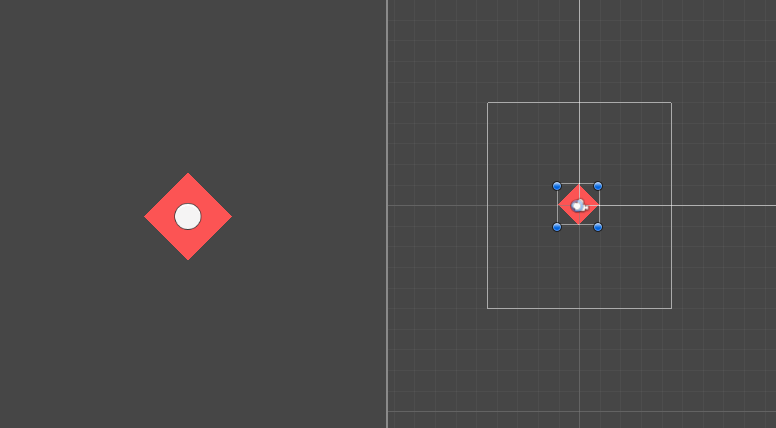
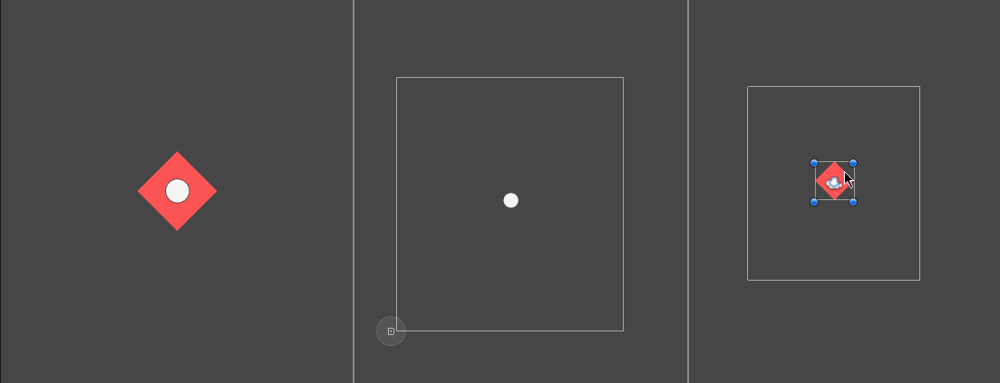

---
## 0x0.引言
屏幕UI指示箭头，非常常见的游戏UI元素。它是一个动态的，可以帮助玩家在目标脱离屏幕范围时指示出大概方位的UI元素。  
它在游戏中可以充当多种功能，如在玩家受到伤害时只是伤害来源位置、如显示任务目标点或游戏资源的位置、如在多人游戏中显示队友的位置等等。下图是游戏COD16的一张截图，此图非常直观的显示出了UI Arrow的作用。　　
  
本文将讲述如何在Unity中实现UI指向箭头的效果。

## 0x1.基础思路
我们希望指示箭头会一直显示在屏幕中，如果目标物体出现在屏幕中时，指示箭头会显示在目标物体的屏幕坐标位置，而目标物体离开屏幕视野时，指示箭头会在屏幕边缘显示其位置。  
那么其对应的基本思路是非常明确且清晰的：将目标物体世界坐标转换为对应的屏幕坐标，然后根据其屏幕坐标限制其的显示位置，若坐标不在UI范围内，则限制其坐标点使其先是在边缘位置。  

## 0x2.编码实现
此处的编码我将会一步一步进行实现直至实现最终效果。  
### 0x2.0.坐标转换  
本文使用2D物体作为演示目标。  
Unity的坐标转换是开发者遇到的非常常见的问题，转换坐标只需要关注不同坐标轴的对应原点和坐标轴朝向即可，具体的计算可以通过Unity提供的API实现。  
此处用到的转换关系为：2D世界坐标轴->2D屏幕坐标轴。本文使用的UI为Unity自带的UGUI系统，用到的API为：
```csharp
RectTransformUtility.WorldToScreenPoint(Camera cam, Vector3 worldPos)
```
值得注意的一点是，如果将上述API计算得到的值用于RectTransform的anchoredPosition，则需要将该UI元素的锚点设置为left-bottom。这样做的目的是使得两个坐标轴的原点一致，如果想忽略锚点所带来的影响，则直接把计算得到的值赋值给RectTransform.position即可。

### 0x2.1.限制范围  
目前的效果仅仅只是做出了坐标转换，并没有把UI元素限制在视口范围内。现阶段的效果如下：  
  
上图中，红色菱形方块代表世界物块，白色圆形物体代表UI指向箭头。从图中可以发现白色UI始终在屏幕坐标中的正确位置，但是当右侧红色物体移动至屏幕外时，白色物体也跟着移动到了屏幕外。这显然不是想要的效果。  
下一步的工作就是将UI元素的位置限制在玩家的屏幕内。  
由于使用的是UGUI，所以此处的“玩家屏幕范围”应该特指挂载了Canvas组件的RectTransform的大小。故在脚本中需要引用一个canvas组件。  
单纯的限制范围实现非常简单，下面的代码演示了如何将一个UI物体限制在某个指定的矩形范围内。  
```csharp
private Vector2 GetClampPos(Vector2 pos, Rect area)
{
    Vector2 safePos = Vector2.zero;
    safePos.x = Mathf.Clamp(pos.x, area.xMin, area.xMax);
    safePos.y = Mathf.Clamp(pos.y, area.yMin, area.yMax);

    return safePos;
}
```
此处关键信息为Rect结构内的xMin，xMax，yMin，yMax等值的确定。上文提到为了得到范围，我们需要获取到挂载了Canvas组件的RectTransform，那么这些值便可以通过其来确定。  
则上述代码中的area参数的确定方法如下：  
```csharp
private Rect CalRectByCanvas(Canvas c, Vector2 uiSize)
{
    Rect rect = Rect.zero;
    Vector2 area = c.GetComponent<RectTransform>().sizeDelta;

    //减去uiSize的一半是为了防止UI元素一般溢出屏幕
    rect.xMax = area.x - uiSize.x / 2;
    rect.yMax = area.y - uiSize.y / 2;
    rect.xMin = uiSize.x / 2;
    rect.yMin = uiSize.y / 2;

    return rect;
}
```
值得注意的一点是，如果UI元素的pivot属性不在中心点（0.5,0.5），则上述代码中的计算也要进行相应的变更使得UI元素不会溢出屏幕。  

### 0x2.2.功能实现
坐标转换与限制范围均实现后，直接将其代码结合起来。最终的实现代码也就下面这一句：
```csharp
rectTrans.position = GetClampPos(RectTransformUtility.WorldToScreenPoint(Camera.main, target.position), CalRectByCanvas(canvas, rectTrans.sizeDelta));
```
最终实现效果如下： 
  
其中最左侧显示为游戏实际效果，中间白色区域为UI限制区域，右侧白色区域为摄像头限制区域。

## 0x3.拓展功能
有些UI指示标中会显示一个箭头，且箭头方向会指向物体方向。通过本方式去改造成该效果也非常简单。  
下面将其代码改造为仅当物体在视野外时显示UI标，且拥有一个箭头指向。  
检测物体是否处于视野外有多种方式，在Unity中，可以通过内置回调函数```void OnBecameVisible()```和```void OnBecameInvisible()```来检测物体是否处于渲染状态，但是在此处不适合。因为此处控制脚本挂载在UI元素上。第二种方式是使用Renderer类中的isVisible属性判断。很明显，使用后者满足场景需求。  
值得注意的一点是，上述两种方式仅当所有scene视图与game视图中的物体均不可见才会返回false。  
添加一个指示箭头无非多一步用于计算方向，Unity中，如果需要朝向计算，在3D中可以使用LookAt方法实现，但是在2D情况下，LookAt方法的转向轴并非正确，下面的代码实现了2D情况下的LookAt方法：
```csharp
public Vector3 LookAt2D(Transform from, Vector3 to)
{
    float dx = to.x - from.transform.position.x;
    float dy = to.y - from.transform.position.y;
    float rotationZ = Mathf.Atan2(dy, dx) * 180 / Mathf.PI;
    rotationZ -= 90;

    float originRotationZ = from.eulerAngles.z;
    float addRotationZ = rotationZ - originRotationZ;
    if (addRotationZ > 180)        
        addRotationZ -= 360;

    return new Vector3(0, 0, from.eulerAngles.z + addRotationZ);
}
```
将得到的角度赋值给箭头对象的eulerAngles属性后就得到了一个朝向标。效果如下：   
  
值得注意一点是，箭头的图片默认应当是朝向上方，否则会出现旋转错误。如果箭头方向无法默认向上，则需要修改LookAt2D方法中的计算使得计算以箭头朝向为基准。

## 0x4.示例代码
上述具体脚本可以[点击此处下载](../assets/downloadable/UIArrow.cs)。  

## 0x5.使用方法
将脚本挂载在UI元素上，赋值上正确的Target，Canvas和Arrow即可预览效果。


---