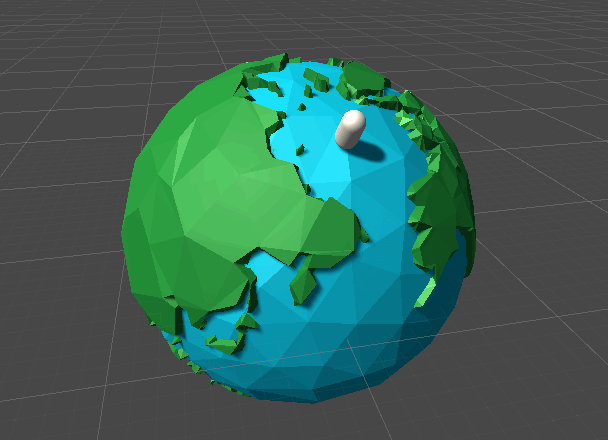
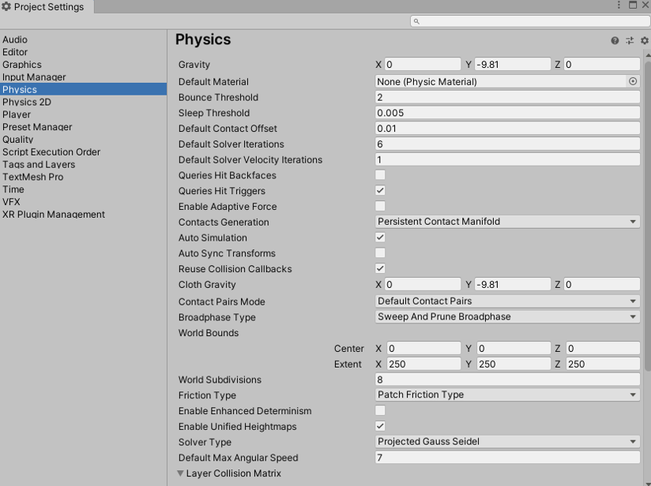
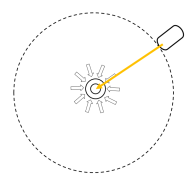
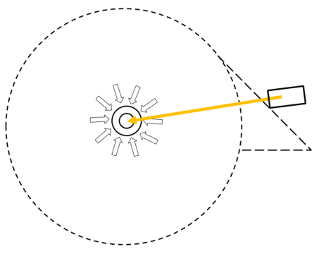
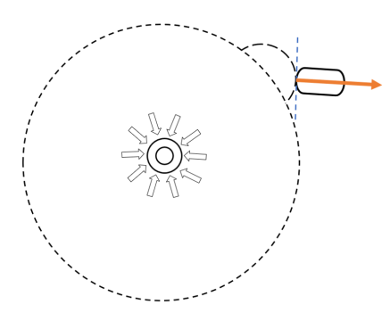

---
## 0x0.引言
在一些游戏内的星球体积是很小的，但是小小的星球仍然有引力。游戏内的物体是可以贴在其表面上的，如同文学作品《小王子》中所形容的小小星球那样。  
 
<a href="https://medium.com/xovr%E9%85%B7%E5%AE%85%E8%AA%AA/xross-bound-vol-02-%E4%BE%86%E8%87%AAb612%E8%A1%8C%E6%98%9F%E7%9A%84%E9%83%BD%E6%9C%83%E5%B0%8F%E7%8E%8B%E5%AD%90-f861bce86fce" tagret="_blank"><center>图片来源点击此处</center></a>

对于静态物体（如上图的小树苗小花等）而言，可以将其直接放置在小小星球上的固定位置，但是对于动态可移动的物体呢？如果需要实现动态的物体沿着球面行走呢？注意到上图的星球并非一个规则的球体，其存在凸起等。那么如何在Unity中实现这样的效果？  
本文介绍如何使用Unity制作一个球面行走的效果，其最终效果如下图所示：


## 0x1.思路
要实现这样的效果，其思路并非是使得需要绕面行走的物体单纯去计算其绕某一个点旋转。因为其表面并非一个规则球体。  
那么如何着手解决这个问题？  
思考一下现实中物体是如何贴在星球表面的呢？其主要原因便是**重力**。在Unity的物理引擎中对重力是实现了的，并且可以通过Rigidbody组件去修改其是否受重力影响。对于重力的整体设置则可以在ProjectSetting的Physics选项卡中找到。

但是Unity的重力方向默认是朝向世界坐标-y轴方向的，仅仅调节此处的设置是并不能满足需求的。那么从这个地方思考开去，我们就能得到其解决思路：**模拟重力**。

## 0x2.编码实现
对于重力模拟，仍然通过Rigidbody组件来实现，首先需要将上面默认的useGravity选项取消防止物体受到默认重力设置的影响。  
然后需要确定一个重力的方向，这里可以通过对场景中某个物体的位置引用来计算重力方向，也就是说，加入场景中存在一个物体作为引力中心，它对其他物体产生重力影响，其好处是可以通过调整其位置来动态更改引力中心，也可以通过更换引用来实现。  
在这种方式下，重力方向为从物体的位置到引力中心位置的方向向量。如下图中黄色箭头所示：
  
这里的实现方式比较简单，其代码也就一句话：
```csharp
//gravityCenter为引力中心
Vector3 gravityDir = (transform.position - gravityCenter.position).normalized;
```
但是对于其物体如何“站立”的问题，可以分为两种计算方式，其不同的计算方式导致的效果也是不一样的。其一是可以将物体站立的方向设置为上图中重力方向的反方向。这样粗略看上去的效果是没有问题的，但是对于一些细节还是会有错误。如果物体站立在一个斜坡上，这样的物体站立的朝向会出现错误，会出现下图的结果：  
  
这样是不太符合常理的，虽然现实生活中是通过摩擦力重力等等各种力的相互作用导致我们站在斜坡上，但是很明显不应该是这样的站立方向。
这种方向的编码实现也是非常简单的：
```csharp
transform.rotation = Quaternion.FromToRotation(transform.up, gravityDir) * transform.rotation;
```

另外一种计算方式则比较符合现实情况，站立方向朝向脚下地面的法线方向，也就是下图中橙色箭头方向。
  
要实现这样的站立方向需要用到碰撞检测，需要获取到脚下的方向与碰撞体的碰撞点，然后对其进行法线方向的计算，好在Unity中是直接提供了碰撞点的，我们可以在`OnCollisionEnter/OnCollisionStay`方法中对其进行计算。
```csharp
private void OnCollisionEnter(Collision collision)
{
    transform.rotation = Quaternion.FromToRotation(transform.up, 
    //这里只取第一个碰撞点，如果没有穿透，一般只有一个碰撞点，但是如果是墙角等情况还是要分开处理
    collision.contacts[0].normal) * transform.rotation;

}
```
这样处理的方式也是可以的，但是在凹凸不平的表面行走时，可能出现非常鬼畜的情况。故需要对其碰撞角度做出一定限制，在角度未达到某一个阈值的时候不需要进行法线站立。其编码可以改成如下形式：
```csharp
private void OnCollisionEnter(Collision collision)
{
    float angle = Vector3.Angle(transform.up, collision.contacts[0].normal);

    if (angle > 45f)
        transform.rotation = Quaternion.FromToRotation(transform.up, collision.contacts[0].normal) * transform.rotation;
    else
        transform.rotation = Quaternion.FromToRotation(transform.up, (transform.position - gravityCenter.position).normalized) * transform.rotation;
}
```
这样做在一定程度上缓解了鬼畜问题，但是距离“好用”的程度还差不少，此处仅提供思路，具体优化可以自行去调试实现。

## 0x2.示例代码
使用第一种站立方式的移动代码具体脚本可以[点击此处下载](../assets/downloadable/RingMovement.cs)。  

## 0x3.使用方法
将脚本挂载在移动物体上，赋值上正确的GravityCenter，运行后按下w/s键移动即可预览效果。

---