---
## 目录
[0x0. 引言](#1)  
[0x1. 主要功能](#2)  
[0x2. Input Profile](#3)  
[0x3. Input Action Editor](#4)  
[0x4. 内建Action](#5)  
[0x5. 代码生成](#6)  
[0x6. 如何拓展](#7)  
[0x7. 使用方法](#8)  
[附录](#9)  

---
<h2 id="1">引言</h2>

MLInput System是本人为Unity开发的一个可用于Unity游戏引擎的，专为键鼠/Xbox One控制器设计的一套输入管理解决方案。其基于<a href = "https://github.com/speps/XInputDotNet" target = "blank">XInputDotNet开源方案</a>与Unity原生Input Manager改进而来。

---
<h2 id="2">主要功能</h2>

MLInput System的主要功能是面向键盘/鼠标/Xbox 360以上的Xbox手柄设备提供一个便于管理与修改的输入功能，同时对游戏中可能出现的复杂操作进行剥离以方便开发。  
该输入系统为XInputDotNet改进而来，仍然保持为DLL拓展的模式，主要分为接口DLL‘`XInputInterface`’与功能DLL‘`MLInput`’，为了便于管理，移除了原先的命名空间‘`XInputDotNetPure`’。  
由于Unity原生Input Manager并不能统一Xbox与键鼠的操作，MLInput System提供了一种更加方便的输入接口‘`GInput`’，该类为静态类，可通过该类检测所有支持的输入状态。该类基本是集成了Input中的部分API与本人之前<a href="http://ghostyii.com/xinput/" target="blank">改进过的XInput脚本</a>内的部分API。  
输入系统的核心为InputProfile文件，该文件为Unity可识别的ScriptObject文件。其保存了用户所有输入配置。该配置文件可以动态通过`MLInputManager`类来管理，也可以通过Input Action Editor自动生成的代码文件来管理。  

### 核心结构
MLInput System对输入分为了两种类型，分别是**Action**和**Binding**，多个Action可以构成一个**Action Group**，InputProfile实际上是保存了一系列的Action Group。对于一个Action Group而言，其下的所有Action返回值应当是一致的，在其中任意一个Action触发的时候，Action Group也被触发。  

---
<h2 id="3">Input Profile</h2>

InputProfile是该输入系统中用于保存用户输入配置的文件，该文件继承于ScriptObject，可通过Unity的序列化系统生成。用户可通过`Asset-Create-MLTools-MLInput-InputProfile`或者通过在`Project视图中点击右键-Create-MLTools-MLInput-InputProfile`来生成。
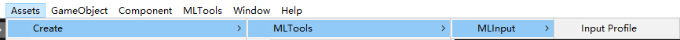  
<center>生成方式1</center>  

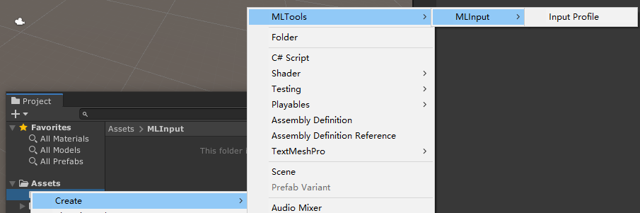  
<center>生成方式2</center>

---
<h2 id="4">Input Action Editor</h2>

生成InputProfile后并不能在Inspector面板直接编辑其内容，MLInput System提供了一个可视化的编辑器用于编辑InputProfile文件，即**Input Action Editor**，用户可以在菜单栏中的`MLTools-MLInput-Input Profile Editor`选项中开启。  
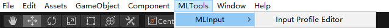

开启后点击**OPEN INPUT PROFILE FILE**按钮，在弹出的窗口中选择需要编辑的文件，即可进入编辑界面，编辑界面如下图所示。
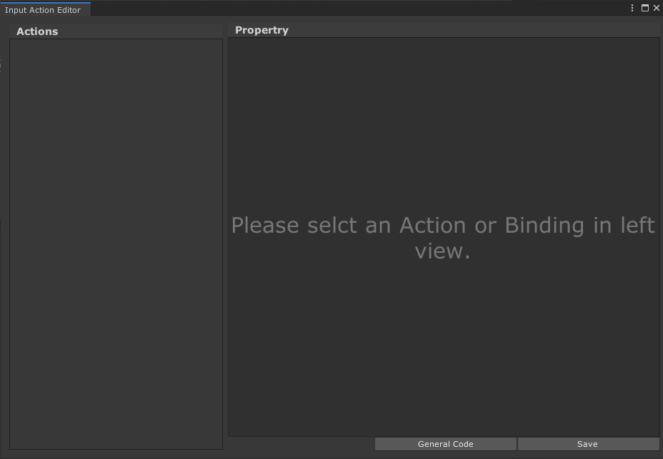

界面主要分为3部分，左侧部分是所有的Action Group与Action的树状列表，右侧显示当前选择的Action相关属性。右下方则是功能区。

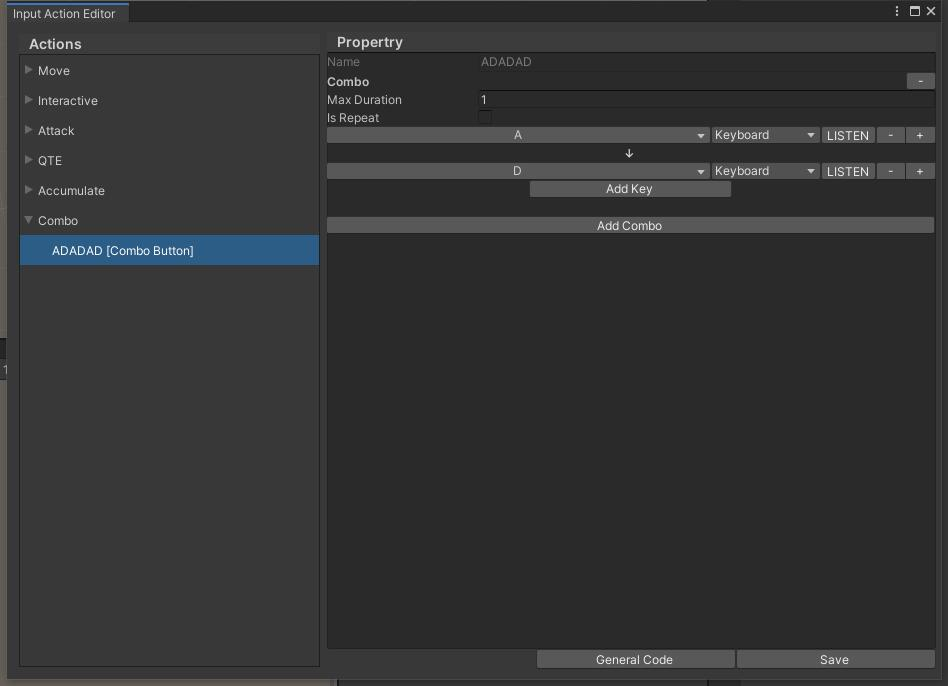

#### 新增Action Group
在左侧Actions显示框中点击右键，选择`Add Action`即可添加一个Action Group。对于Action Group而言，其属性只有一个，在属性面板中选择Return Type即可为该Group指定返回值。   
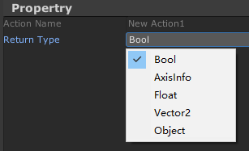

MLInput System目前支持的返回值类型如上图中所示，除了常规的类型之外，用户可以使用自定义类型并指定为Object类型，该类型会返回object。

#### 新增Action并确定Binding
在刚刚添加好的Action位置点击鼠标右键，即可为该Action Group添加Action，MLInput System支持用户拓展Action，也可以直接选择内建的7种Action中的一种。
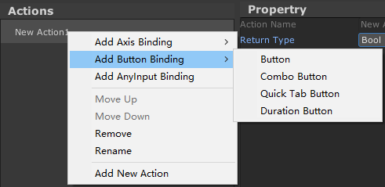

如果是指定按键，可以选择最基础的Button Action，添加ButtonAction后即可在属性视图中编辑其属性，ButtonAction内包含三种最基础的Binding，即键盘按钮、鼠标按钮和Xbox控制器按钮。
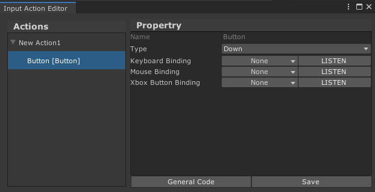

用户可以在左侧下拉列表中寻找键值，也可以通过点击右侧的`LISTEN`按钮后按下相应按键后再点击Apply按钮来确定绑定的键值。  
*注意：*  
*1.目前LISTEN功能暂不支持监听键盘的shift按键，如需绑定shift按键，请在左侧列表中手动选择。*  
*2.点击对应位置的LISTEN按钮仅支持对该类型的键位的监听，如在Xbox Button Binding后的LISTN按钮处按下键盘和鼠标按键将会被忽略。*  

#### 其他功能
左侧的列表支持拖拽排序。

---
<h2 id="5">内建Action</h2>

MLInput System 目前内建了7种不同的Action，主要分为3个类别：Button类型、Axis类型与Any类型，其基础属性如下表所示。
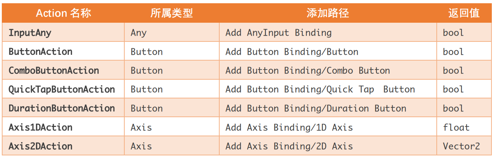

#### Any
InputAny代表任意输入，返回值为bool，当任意输入（注意是任意输入而不是任意Action）被触发时返回true，其余返回false。  
属性面板上的三个开关可屏蔽某一种类型的输入。
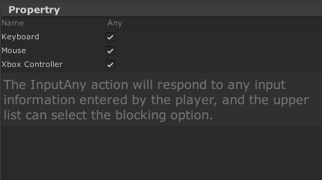

#### Button
Button是最普通的按键绑定Action，其属性面板也非常简洁。包含Keyboard、Mouse和Xbox Controller的按键绑定事件。属性中的Type指定了该Action的触发类型，其类型包括“Down、Up和Hold”三种，分别代表了该按键按下（响应一次）、按键抬起（响应一次）和按住（每帧响应一次）三种类型。
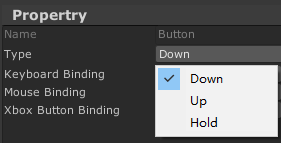

该Action返回bool值，当三种按键中任意一种按键被触发时返回true，其余返回false。

#### Duration Button
Duration Button为持续性响应Action，返回值为bool，此类型的Action可以监听某一按键是否被按下若干时间，其属性只比Button多出Duration一个字段，其代表触发所需要的时间（单位：s）。  
该类型在指定按钮被按下特定时间时返回true（响应一次），其余时间返回false。
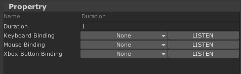

#### Quick Tap Button
Quick Tap Button为多次按键监测Action，返回值为bool，此类型的Action可以监听特定按键是否在某一段时间内被触发多次，其属性相对于DurationButton，只多出了一个Min Tap Count字段，用于指定达到响应条件的最小检测次数。  
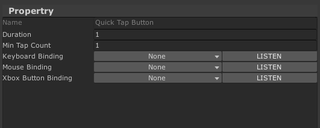

如指定Duration=2, MinTapCount=5 Keyboard Binding=Space, Xbox Button Binding=LB，则该Action会在空格键第一次被按下开始的2s内，空格和手柄的LB键合计按下5次时触发一次返回true，其余时间返回false。

#### Combo Button
Combo Button为组合键，用户可以指定一系列的组合键来作为触发条件，返回值为bool。  
默认状态下，组合键为空，点击`Add Combo`按钮来添加一个组合键。默认状态下，组合键内不含任何键值，可以点击`Add Key`按钮来为特定组合键添加键位。当某一组合键包含一个以上的键位时，便可以调节该组合键的`Max Duration`和`Is Repeat`属性。其中，`Max Duration`指定了该组合键最长响应时间，即超过该响应时间内未完成组合键，本次触发失败。`Is Repeat`指定了该组合键是否属于重复组合键，该值为true时，应当指定`Min Repeat Count`属性以规定最小重复次数。

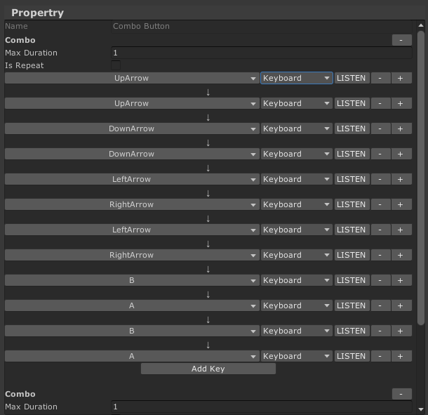

组合键也支持不同设备之间键位的组合，同一个Combo Button内可以有多个Combo，当其中任意一个Combo被触发时返回true，其余时间返回false。

#### 1D Axis
1D Aixs为基础轴输入，可以指定一个一维的轴，返回值为float。  
**MLInput System中的内建轴输入返回值均为float，其范围是[-1,1]，输入轴的默认值为0，当输入偏向Positive时，值向1移动，输入偏向Negative时，值向-1移动。**  
一维轴可以是原始轴，也可以是由两个按钮组成的轴。原始轴包括以下内容：  
- 鼠标水平方向
- 鼠标竖直方向
- 鼠标滚轮方向（向上为正向，向下为反向）
- Xbox 左摇杆水平方向
- Xbox 左摇杆竖直方向
- Xbox 右摇杆水平方向
- Xbox 右摇杆竖直方向
- Xbox 左扳机
- Xbox 右扳机

**值得注意的一点是，对于原始轴中的左右扳机，其轴值只会在[0,1]中浮动。而并非Unity原生Input Manager中的左扳机为反向，右扳机为正向的[-1,1]中取值。**  
当Type为Button时，可以为轴指定两个按钮作为左右方向来作为一个轴，按钮轴与原生轴的区别之一是按钮轴只会在-1、0、1三个值中跳动，而原生轴可以在[-1,1]之间平滑移动。

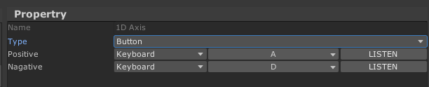

#### 2D Axis
2D Axis为二维轴输入，可以指定一个二维的轴，返回值为Vector2。  
其本质是2个1D Axis组成的二维轴。其中返回值的x方向为Horizontal，y方向为Vertical。

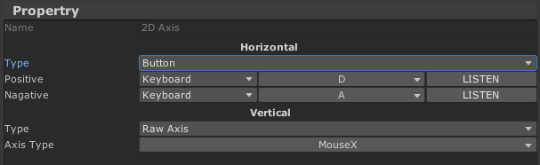

---
<h2 id="6">代码生成</h2>
在编辑好InputProfile之后，用户可以通过MLInputManager脚本对编辑好的profile进行调用，也可以通过自动生成一个单例Mono脚本方便调用与后续修改。

生成代码的方式是通过点击Input Action Editor功能区的`General Code`按钮，在出现的面板中填写类名与命名空间名称，再选择保存路径后点击`Accept`按钮来自动生成代码。
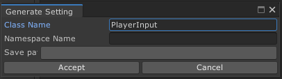

生成的类是一个单例类，可以通过**类名.Instance.方法名**来调用其中的内置方法与属性。其代码示例（部分代码）如下：
```csharp
using MLInput;
using UnityEngine;

public class PlayerInput : Singleton<PlayerInput>
{
    public InputProfile asset;

    private MLInputManager im = new MLInputManager();

    protected override void OnAwake()
    {
        im.Init(asset);
    }

    #region Action Properties
    public Vector2 Move { get => im.GetVector2Input(asset.FindActionsByName("Move")); }
    public bool Attack { get => im.GetBoolInput(asset.FindActionsByName("Attack")); }
    #endregion
}
```
其中，Action Properties折叠区中即为所有的Action Group。只需要将生成的脚本挂载到场景中，并且指定对应的InputProfile即可在项目中使用。

---
<h2 id="7">如何拓展</h2>

MLInput System支持用户自定义Action，其步骤也比较简单，只需要新建一个类，继承自**MLInput.InputActionBase**即可成为一个自定义的Action。  
仅仅继承了InputActionBase的派生类并不能被Input Action Editor所识别，还需要在该类上指定一个**InputActionTypeAttribute**。  
InputActionTypeAttribute中有两个参数可选，一个是menuItemName，一个是nickname。其中menuItemName指定在Input Action Editor中的路径，nickname指定在Input Action Editor中显示的类型名称。  

触发条件可以在脚本中自定义方法，该方法不得含有参数，返回值可以任意选择。在编写好参数后，只需要在该方法上加上`InputActionTriggerAttribute`特性即可。  
下面是一个简易的示例：
```csharp
using MLInput;
using UnityEngine;

[InputActionType(menuItemName = "Custom New Action", nickname = "DIY Type")]
public class NewAction : InputActionBase
{
    [SerializeField]
    private int count;

    public int Count { get => count; set => count = value; }

    public NewAction()
    {
        count = 0; 
    }

    [InputActionTrigger]
    public bool IsTriggered()
    {
        if (GInput.GetKeyboardKeyDown(KeyboardKeyCode.Space))
            count++;

        if (count > 6)
        {
            count = 0;
            return true;
        }
        else return false;
    }
}
```
添加上述代码后，即可在Input Action Editor中添加该类型的Action，所有用户自定义的Action会被归类到“Add Custom Binding”一栏中。
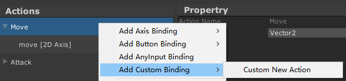
<center>添加前</center>

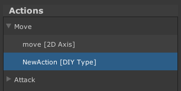
<center>添加后</center>

#### 自定义Action编辑器脚本
如果仅仅添加上述脚本，在Input Action Editor中的属性视图中并不能显示出任何可调节的参数，即使你在脚本中声明为public或者[SerializeField]，这是因为目前的MLInput System并不支持自动序列化属性，仍然需要用户手动编写编辑器脚本。  
要自定义编辑器，需要编写一个可以被MLInput System识别的编辑器脚本，这个脚本需要继承于`MLInput.Editor.InputActionDrawer`，并且标记`MLInput.Editor.CustomInputActionDrawerAttribute`特性，通过传入Type来实现识别（此过程类比于Unity Editor编程中的PropertyDrawer）。  
上述步骤完成后，只需要重写OnGUI函数即可在InputActionEditor中显示其属性了。  
例如上方的NewAction，可以编写如下的编辑器脚本，放在Editor文件夹中。
```csharp
using UnityEngine;
using MLInput;
using MLInput.Editor;
using UnityEditor;

[CustomInputActionDrawer(typeof(NewAction))]
public class NewActionDrawer : InputActionDrawer
{
    public override void OnGUI(Rect position, InputActionBase action)
    {
        NewAction newAction = action as NewAction;
        GUI.BeginGroup(position);
        EditorGUILayout.LabelField("This is custom label");
        newAction.Count = EditorGUILayout.IntField("Count", newAction.Count);
        GUI.EndGroup();
    }

    public override float GetPropertyHeight(InputActionBase action)
    {
        return EditorGUIUtility.singleLineHeight * 3;
    }
}
```
编写完上述代码后，即可在Input Action Editor中显示属性了，如下图所示：
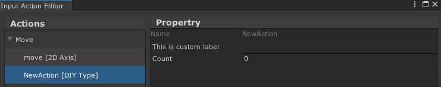

*值得注意的几个地方：*
*1.目前的MLInput System并不支持自动布局，如果想要使用EditorGUILayout或者GUILayout，需要如上方代码所示，手动指定Group。*
*2.目前的MLInput System对属性的高度计算也并不准确，如果出现高度计算错误的情况，需用户在Editor脚本中重写GetPropertyHeight方法。*

---
<h2 id="8">使用方法</h2>

1. 在Unity工程Assets文件夹中新建Plugins文件夹（已存在则忽略）
2. 在Plugins文件夹中放入XInputInterface.dll文件（建议x86和x64分开放）
3. 将MLInput.dll文件一同放入Plugins中
4. 等待Unity重新加载完成

---
<h2 id="9">附录</h2>

插件下载地址：[MLInput_Alpha.zip](../assets/downloadable/MLInput_Alpha.zip)  
github 开源地址：目前MLInput System刚进入Alpha阶段，待本人继续开发完成至beta阶段时会将代码托管至github上  
插件API文档： 会随着beta版本一并放出

---