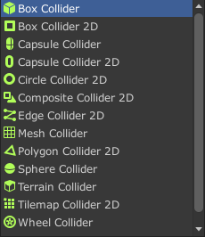
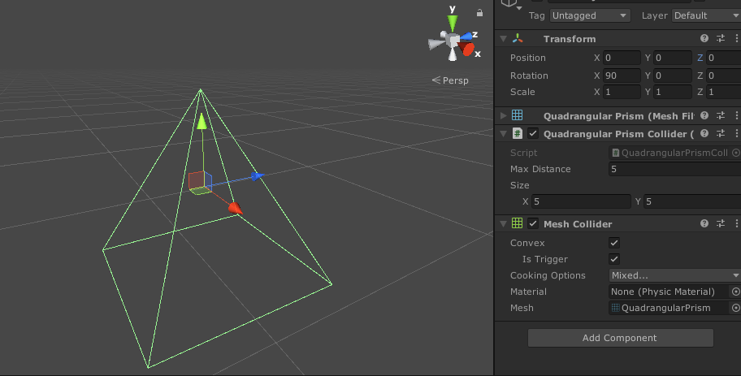
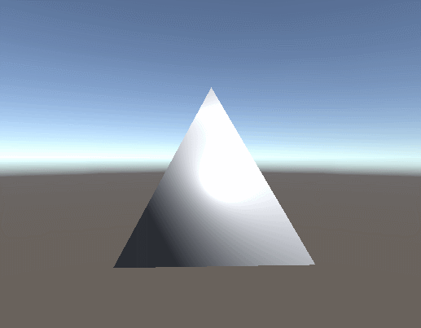

---
<h2 id="1">引言</h2>
在Unity中内置了许多自带的Collider，这些Collider已经可以满足游戏开发中的绝大部分需求。本文介绍一种四棱锥碰撞体生成方案，可生成不同形状的四棱锥碰撞体。

  
<center>内置碰撞体</center>
使用本文方法生成的四棱锥碰撞体如图所示：


<h2 id="2">生成原理</h2>
生成该碰撞体的主要原理是动态生成一个四棱锥的网格，然后使用该网格产生Mesh Collider以实现效果。

<h2 id="3">创建Collider</h2>
在创建Collider之前，需要先产生Mesh。那么，一个四棱锥的Mesh如何产生呢？  
回顾一下在Unity中，如何创建一个Mesh，其主要步骤如下：  
- 确定顶点数
- 确定三角面/四角面
- 确定UV
- 计算法线
- 计算包围盒

对于一个用于产生Mesh Collider的四棱锥而言，uv这一步可以跳过。  
四棱锥的顶点数是确定的5个，包括底部矩形的四个顶点和距离矩形一定高度的一个顶点。三角面则是由这5个顶点组成的4个侧边三角面和2个组成底部矩形的三角面构成。
如果我们定义Unity中一个物体的自身位置为四棱锥的上方顶点位置，以该物体自身坐标轴的前方（z轴正方向）maxDistance距离确定一个大小为size的底边矩形，则这5个顶点的位置可以通过以下代码计算：
```csharp
Vector3 top = transform.position;
Vector3 leftUpper = transform.position + (transform.rotation * luVec * size.x / 2f + transform.forward * maxDistance);
Vector3 rightUpper = transform.position + (transform.rotation * ruVec * size.x / 2f + transform.forward * maxDistance);
Vector3 leftLower = transform.position + (transform.rotation * llVec * size.y / 2f + transform.forward * maxDistance);
Vector3 rightLower = transform.position + (transform.rotation * rlVec * size.y / 2f + transform.forward * maxDistance);
```
确定好顶点位置后，需要通过`transform.InverseTransformPoint`API将其转为模型自身坐标位置。三角面的确定则更加简单，假设其5个顶点的顺序如以下代码所示：
```csharp
mesh.vertices = new Vector3[]
{
    transform.InverseTransformPoint(top),               //ver0
    transform.InverseTransformPoint(leftUpper),         //ver1
    transform.InverseTransformPoint(rightUpper),        //ver2
    transform.InverseTransformPoint(leftLower),         //ver3
    transform.InverseTransformPoint(rightLower)         //ver4
};
```
由于计算机中的面默认是有正反面的（反面不渲染），我们需要通过顺时针顶点位置来确定三角面的法线方向，则其6个三角面可以通过以下代码确定：
```csharp
mesh.triangles = new int[]
{
    0,1,2,
    0,3,1,
    0,2,4,
    0,4,3,
    3,2,1,
    2,3,4
};
```
之后再去计算发现和包围盒之后，其Mesh就算创建完成了，这时如果在脚本中加载Mesh Renderer组件或者在Gizmos中绘制Mesh，可以看出已经绘制出了一个四棱锥。如下图所示：


至此，其四棱锥Mesh已经创建完成，之后只需要挂载Mesh Collider组件，勾选convex选项就可以生成一个动态的四棱锥碰撞体了，其碰撞区域可以通过该物体的transform.localScale来调节。

<h2 id="5">附录</h2>
示例脚本[点击此处下载](../assets/downloadable/QuadrangularPrismCollider.cs)。

---