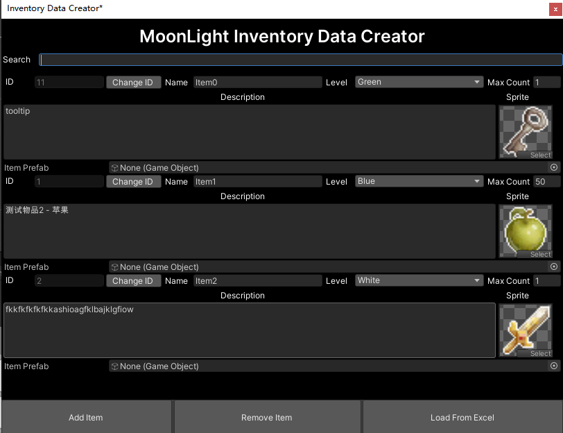
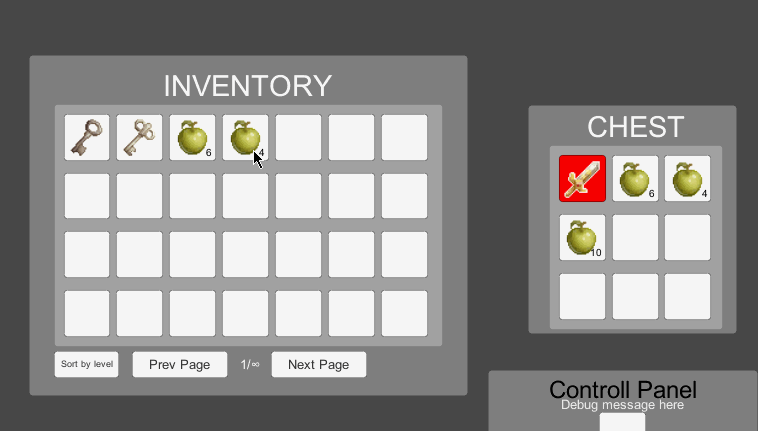

---
MLToolBox是本人为Unity引擎开发的一个外部托管库，采用C#编写，包含多个游戏基础模块。本工程在未来会在github中开源。  
MLToolBox中包含的游戏模块如下：  

### MLObjectPool
对象池，已开源，开源地址<a href="https://github.com/GhostYii/MLObjectPool" target="_blank">点击此处跳转</a>。  
简要介绍文档： [MLObject Pool 简易手册](../mlobjectpool/)

### MLDataImport
配表系统，支持json，csv，xls和xlsx格式文档及表格。  
目前还未开发完成，仅支持csv文档的自动生成class/struct功能。  
开发完成第一个版本后会在github中开源。  
  

csv文件转class/struct

### MLInput
MLInput是一个专为键鼠/Xbox One控制器设计的一套输入管理解决方案。其基于<a href = "https://github.com/speps/XInputDotNet" target = "blank">XInputDotNet开源方案</a>与Unity原生Input Manager改进而来。  
MLInput原计划在MLToolBox工程中，开发完第一个版本后已经独立出去作为单独模块进行开发，其目前还未在github开源，但已经开放下载，并且在修复部分已知bug后将在github开源。  
简要介绍文档： [MLInput System 简易手册](../mlinput/)

### MLInventory
游戏内背包系统，数据通过json保存。也可以通过编辑器工具‘Inventory Data Creator’在Unity Editor中创建与修改物品信息，并且内置简易的UI脚本。
  

Inventory Data Creator
  
目前已实现基础功能，并且在另一个项目中使用。未来将在github中开源。  

  

MLInventory演示（使用build-in UI script）

### MLEventSystem
事件系统，已开源，开源地址<a href="https://github.com/GhostYii/MLEventSystem" target="_blank">点击此处跳转</a>。  
目前功能非常简单，后续功能还在计划与开发中。

### SubtitleSystem
游戏内字幕功能，目前作为一个单独模块在开发，未来将会加入MLToolBox工程。  
已开源，开源地址<a href="https://github.com/GhostYii/SubtitleSystem_Demo" target="_blank">点击此处跳转</a>。  
简要介绍文档： [Subtitle System简易手册](../SubtitleSystem/)

### MLTools
游戏内常用工具类和脚本。包含MLToolBox中其他模块公用的脚本与工具类。  
目前包括Events、Serializer、UI与Utility部分。

### 其余计划中的模块
- MLQuest : 游戏内任务系统
- MLGM : 游戏内GM系统，包含Unity部分与Console部分，通过socket进行通讯
- MLSave : 存档系统
- MLUIManagement : UI层级与显示管理方案
- MLLocalization : 多语言处理方案
- MLPathFinding : 寻路系统
- MLStateMachine    : 状态机
- MLResource    : 资源管理与更新解决方案

### 尾巴
本文档会根据各个系统开发进度进行更新。  
计划中的模块有一些已经开始开发，但更多的处于0进度状态。  
ML的意思是MoonLight。这些工具目前就像月光，不是很闪耀，但是是我自己的一种寄托。  
希望MLToolBox最后可以发展为一个比较成熟的游戏框架。

---