---
本页面记录本人在游戏开发过程中的一些小作品。

### Keep her happiness alive(2020) [Ludum Dare 46 活动作品]
参加ludum dare 46 gamejam 的活动作品，该次gamejam的主题是"Keep it alive"。  
该游戏参加48小时游戏开发大赛的作品。其中程序部分由本人完成，场景编辑与游戏玩法与我的搭档Sush([@sush](http://www.susihao.com/))完成。  
游戏主要玩法为主角在场景中寻找其女友需要的物品并且在最短的时间内送达女友身边以获取分数，女友的喜好会随时间改变，且女友的位置在不停移动。物品的出现是随机的，同时地图上存在部分静态/动态障碍物。  
详细游戏说明可参见此视频：<a href="https://www.bilibili.com/video/BV1e54y197Qd" target="_blank">【Ludum Dare 46】开心是她的，我什么也没有_Bilibili</a>  
Ludum Dare 46 活动地址：<a href="https://ldjam.com/events/ludum-dare/46/keep-her-happiness-alive" target="_blank">Keep her happiness alive JAM GAME by CokeJet</a>  
游戏截图：  
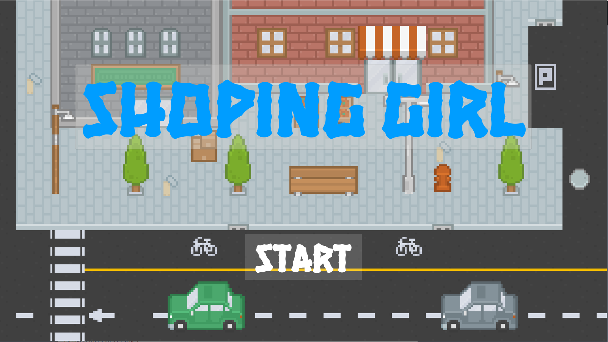
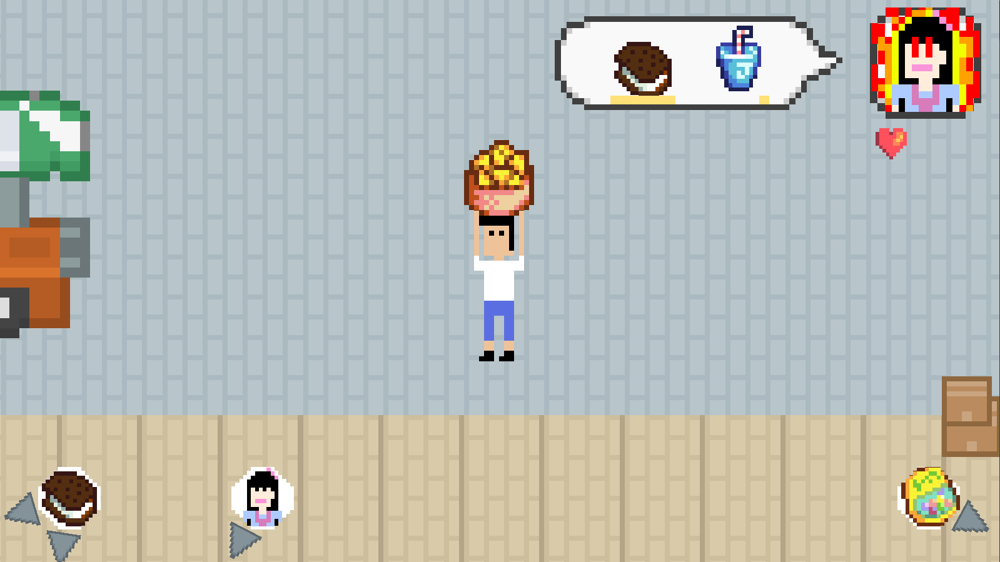
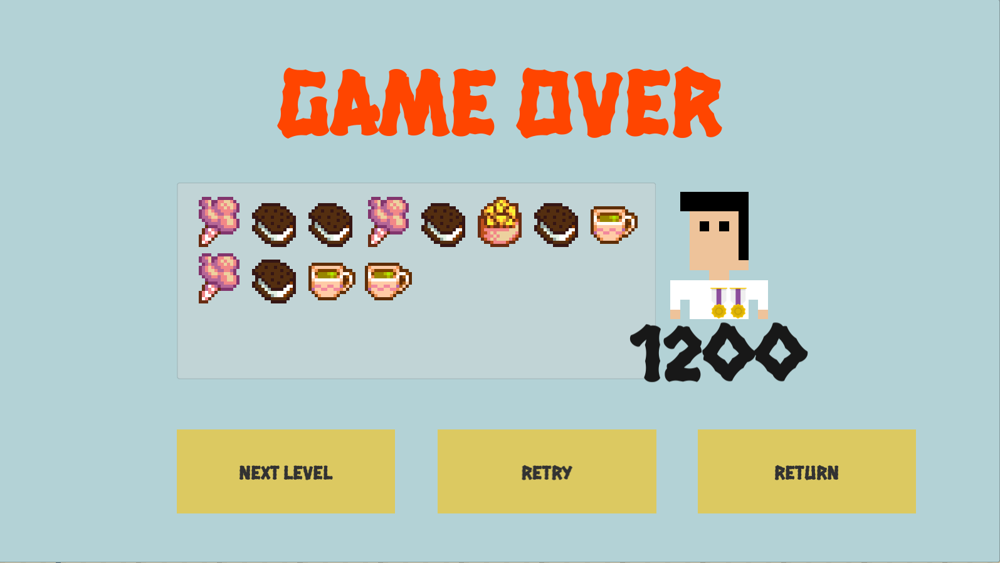

### Gala Dream(2020) [MLLib 集成演示作品]
《Gala Dream》是本人为测试ML系列库（关于ML系列库请<a href="../mltoolbox/" target="_blank">点击此处</a>查看）的一个2D RPG游戏项目。其讲述男主角误入勇者世界，并在其中发生的一系列故事。  
由于ML系列库有不少仍在开发中，故本作品完成度非常低。  
游戏截图：  

### Project K(2018) [本科毕业设计]
《Project K》是本人在本科阶段的毕业设计作品，其游戏类型为局域网联机FPS游戏，采用Unity2017版本开发。  
游戏截图：  

### 体感3D虚拟手术室(2016) [湖南省第十一届中仁教育杯程序设计竞赛（省赛）游戏组二等奖作品]
《体感3D虚拟手术室》是本人在本科期间团队开发的一款游戏作品，该作品参加16年湖南省省赛获得团队赛游戏组二等奖。  
该作品参照3ds游戏《超执刀》开发，以Kinect2体感设备为输入，医疗手术（娱乐为主并不严谨）为关卡。
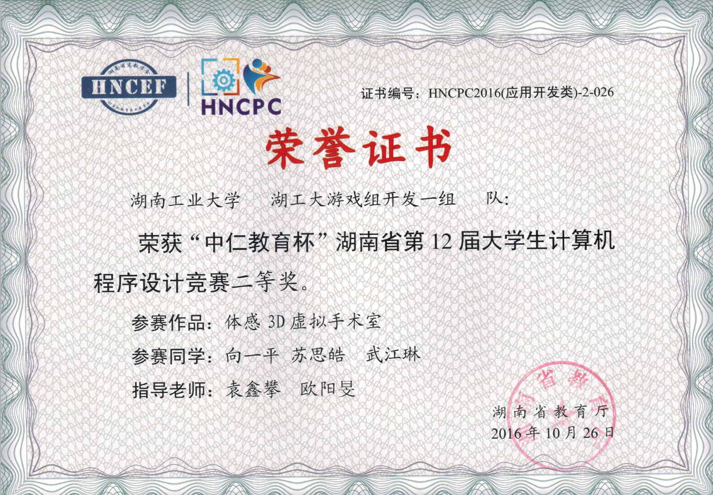
游戏截图：  
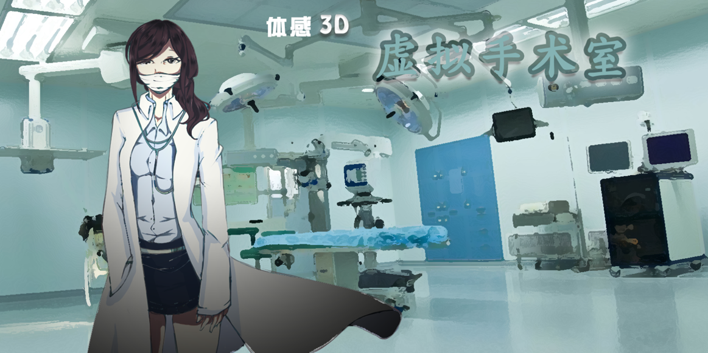
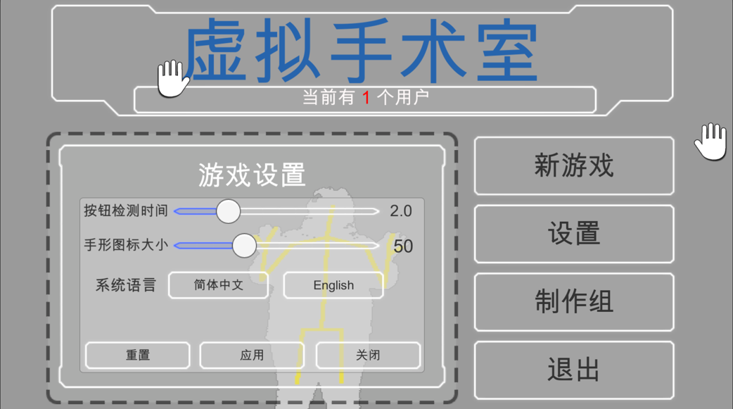
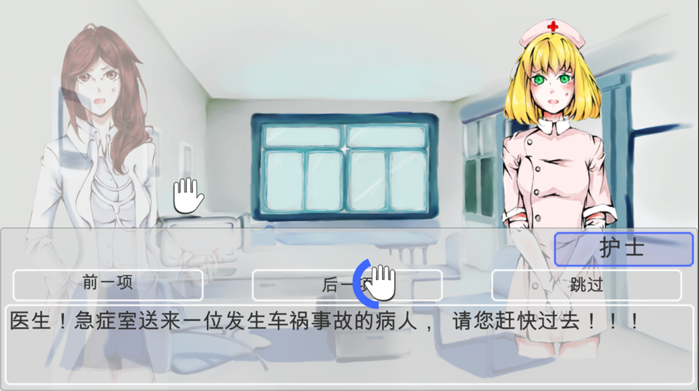
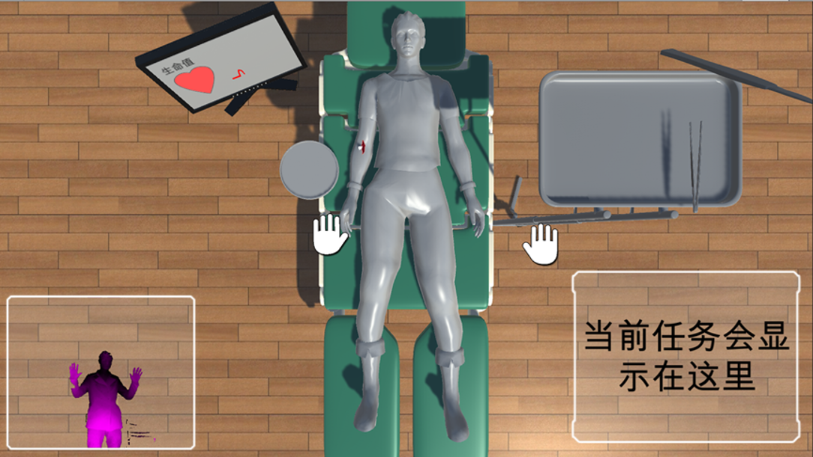
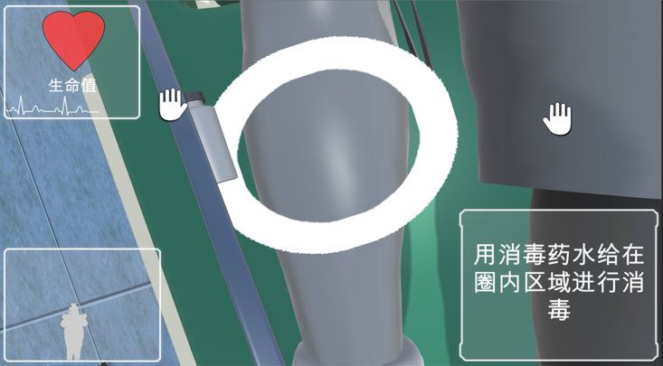

### Deleave Cube(2015)
《Deleave Cube（消除魔方）》是本人在本科期间独立完成的一款Android平台的消除类手游，其主要玩法是点击相同颜色的方块消除，在规定的时间内消除完所有方块后获得游戏胜利。  
游戏详情：<a href="https://www.bilibili.com/video/BV1as411d7yU" target="_blank">【DeleaveCube】自制”双消“游戏_Bilibili</a>  
游戏apk下载： [DeleaveCube.apk](../assets/downloadable/deleavecube.apk)  
游戏截图：  
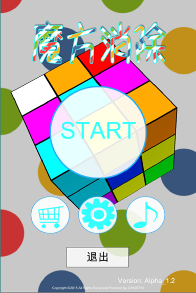
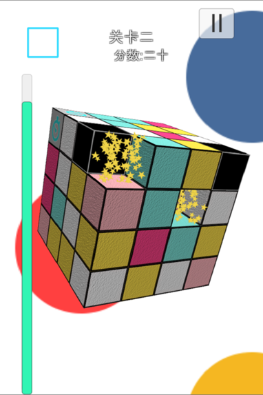
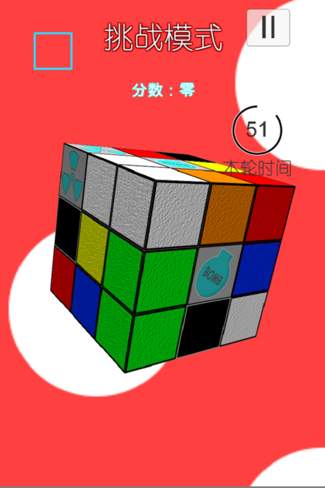
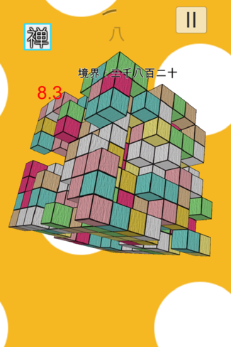

### Nova(2015)
《Nova》是本人在本科暑假期间独立完成的一款2D横板过关游戏，讲述一个名为Xiamurln的角色为了寻找高山上的雪莲花而踏上的冒险旅程。  
游戏最初为PC设计，后暴力移植到了Android平台。  
游戏通关视频：<a href="https://www.bilibili.com/video/BV1as41127cx?t=1155" target="_blank">20分钟打造一个主角丑爆了的游戏_Bilibili</a>  
游戏截图：  
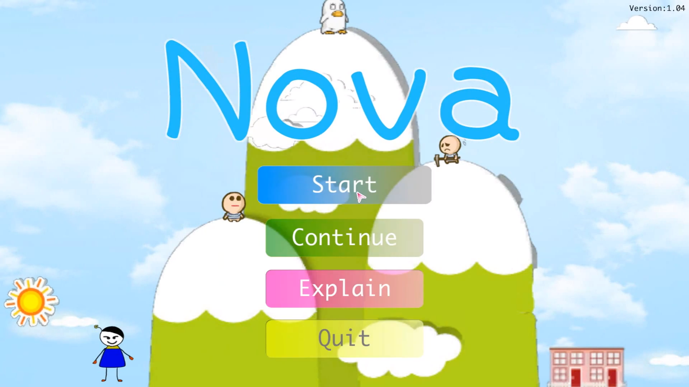
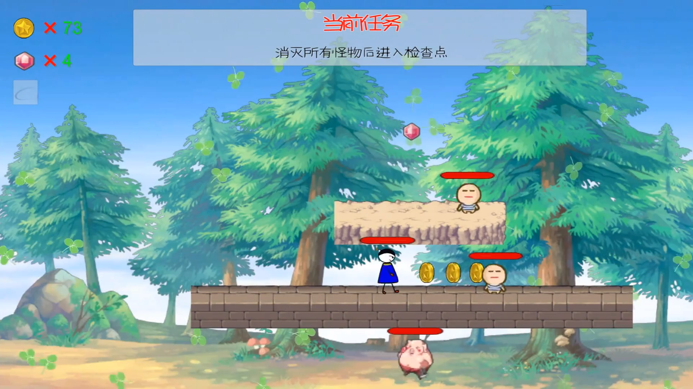
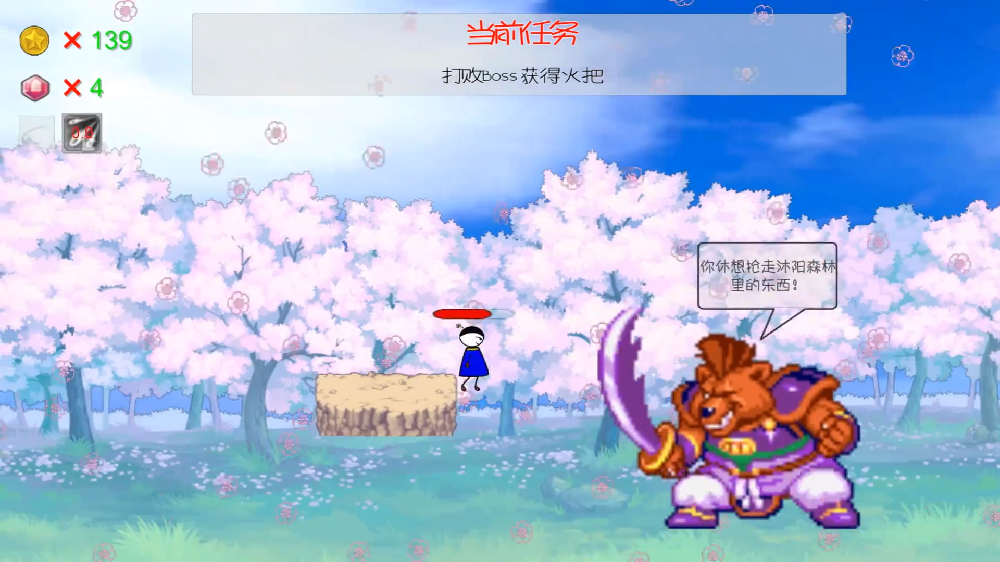
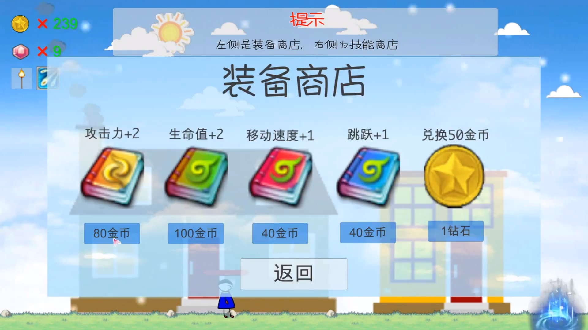
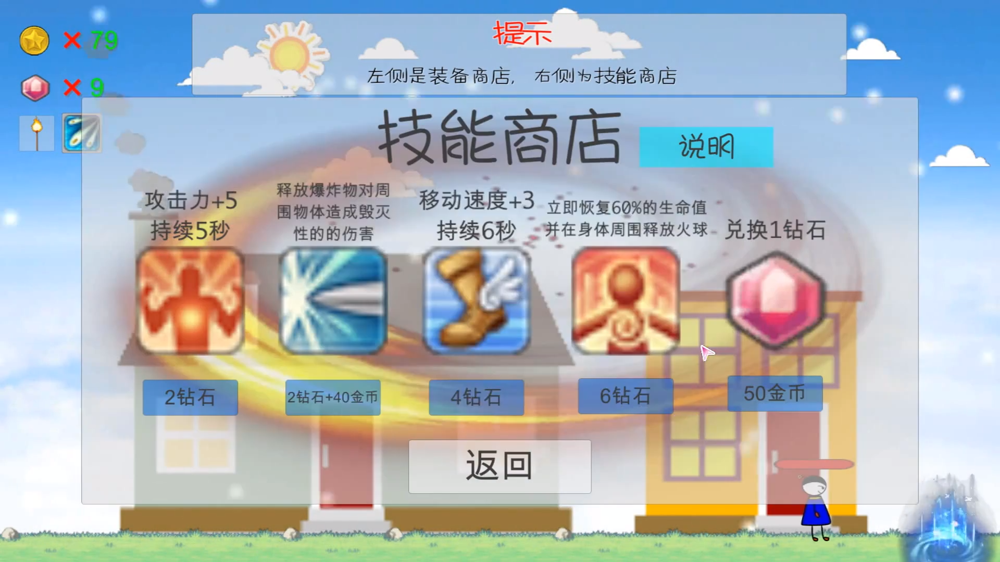
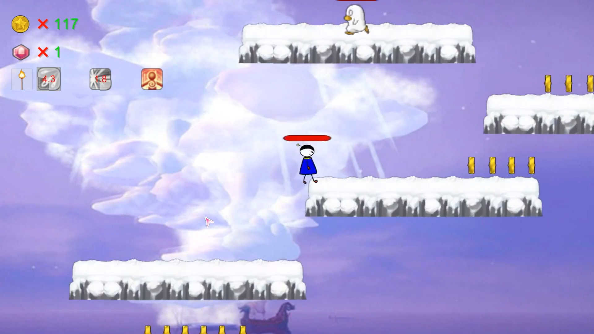
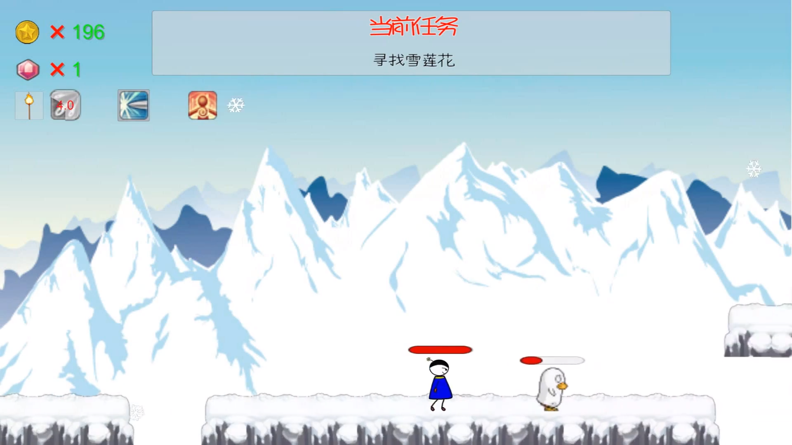

### 1st Car(2015)
《1st Car》是本人学习游戏开发以来的第一个游戏项目，本意是一款3D赛车游戏，但是由于基础薄弱，对程序理解不深刻与对Unity的不熟悉。使得本作品只能算得上是一个入门的demo。  
游戏内包含两辆赛车，教学关卡，两张地图。  
游戏截图：  
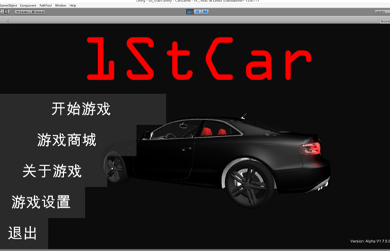
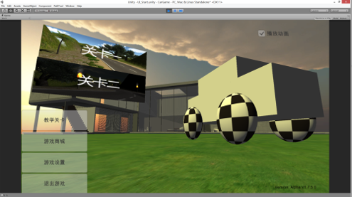
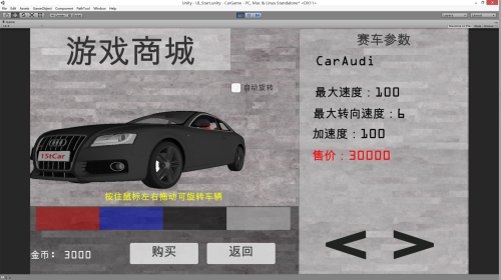
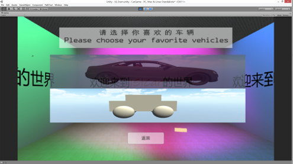
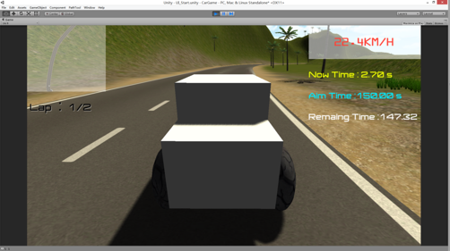

---