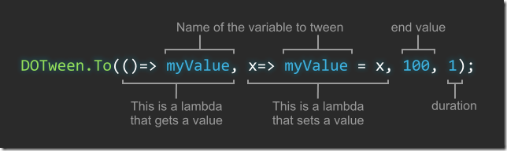

---
## 前言  
在unity中，制作补间动画有很多方法，例如使用自带的API（如Mathf.Leap/Mathf.Sleap等），还可以使用新版本的Animator。  
但是这些方法都不够灵活与方便，所以有许多补间动画的插件出现在Unity的应用商店中，如ITween、DoTween、LeanTween等。  
在这些插件中，我最喜欢的是DoTween，因为这个插件非常简单而又强大。  
本文记录自己在使用DoTween中的一些笔记与在网上查找到的资料的摘抄集合，缓慢更新中。  

---
## 目录
### [1. 导入DoTween - 2017-07-11](#1)
### [2. 通用方法与设定 - 2017-07-11](#2)
### [3. 简易补间动画 - 2017-07-11](#3)

---  
<h4 id="1">导入DoTween</h4>
DoTween作为一个开源的插件，其代码托管在Github上[[Demigiant/dotween - Github](https://github.com/Demigiant/dotween)]，该插件官网
[[DoTween(HotTween V2)](http://dotween.demigiant.com/)]，如果我们只是单纯的想要下载DoTween到我们的项目中，可以直接在Asset Store中
搜索DoTween[[DoTween(HotTween V2) - Asset Store](https://www.assetstore.unity3d.com/cn/#!/content/27676)]来下载。  
下载完成后直接导入Unity，如果是新项目第一次导入Unity，会弹出提示框提示DoTween需要初始化，如下图所示：  
  
点击Setup DOTween按钮即可完成配置，当然如果需要自定义一些参数，可以点击Preferences选项卡来进行设置，该选项卡如下图所示：  
  

初始化完成后，在需要使用DoTween的地方需要引入命名空间DG.Tweening;
这里是一些官方的链接：   
快速开始： http://dotween.demigiant.com/getstarted.php  
官方文档： http://dotween.demigiant.com/documentation.php  

参考资料：[DOTWeen官方网站](http://dotween.demigiant.com/)     

---    
<h4 id="2">通用方法与设定</h4>  
DOTween中拥有通用的调用方法，掌握了这些通用方法可以举一反三来进行自己的补间动画设置，其通用方法如下图所示：  
  
其中第一个和第二个参数可以设置为lambda表达式，表示get和set属性值。  
当然，也可以使用更加简单的方法，如下图所示：  
  

在DOTween的内置API中，拥有几类有明显特征的方法，其主要区别如下：
```csharp
Tweener：一个持有值的控制并使值起作用的tween
Sequence：一个特殊的tween，与其控制一个值，Sequence控制其它tweens和将它们当成一个组。
Tween：一个通用的词，表名包括Tweener和Sequence Nested
tween ： 一个包含在Sequence内的tween。

方法前缀：
DO开头：操作所有已知对象，如transform对象或material对象。当然也是DOTween类的前缀。  
eg:
transform.DOMoveX(10, 1);
transform.DORestart();
DOTween.Play();

Set: 所有可以链式返回tween的设置。（除了From之外，尽管把它当作一个设置来用，但它实际上并不是一个真正的设置）
eg:  
myTween.SetLoops(4, LoopType.Yoyo).SetSpeedBased();

On: 所有可链式返回tween的回调
eg:
myTween.OnStart(myStartFun).OnComplete(myFunction);
```


参考资料：  
[DoTween(HOTween V2) 教程 -- CSDN博客](http://blog.csdn.net/cen616899547/article/details/41349695)  
[DOTween教程 - u012740992的专栏 -- CSDN博客](http://blog.csdn.net/u012740992/article/details/47315459)

---  
<h4 id="3">简易补间动画</h4>  
位移补间动画大都可以通过transform.DoMove来实现，其主要包括以下API：  
```csharp
transform.DoMove();   //位移补间动画
transform.DOMoveX();  //X方向上的补间动画
transform.DoMoveY();  //y...
transform.DoMoveZ();  //z...
```

类似的还有：

```csharp
transform.DoRotate();  //旋转
transform.DoScale();   //缩放
```

除了这种方式调用之外，DOTween还支持使用Tweener对象来创建补间动画，例如：
```csharp
//在1s内从自身位置移动到(5,5,5)位置的tweener
Tween tween = DOTween.To(() => transform.position, r => transform.position = r, new Vector3(5, 5, 5), 1);    

//数值在5s内从自身变化到100的tweener
Tween t = DOTween.To(() => number, x => number = x, 100, 5);  
```
同时在DoTween中，支持以Sequence顺序表的方式创建补间动画，如要实现UI飘字效果(效果如下图)的DOTween代码如下：  

```csharp
RectTransform rt = graphic.rectTransform;
Color c = graphic.color;
c.a = 0;
graphic.color = c;

//创建Sequence
Sequence mySequence = DOTween.Sequence();

//创建tweener
Tweener move1 = rt.DOMoveY(rt.position.y + 50, 0.5f);
Tweener move2 = rt.DOMoveY(rt.position.y + 100, 0.5f);
Tweener alpha1 = graphic.DOColor(new Color(c.r, c.g, c.b, 1), 0.5f);
Tweener alpha2 = graphic.DOColor(new Color(c.r, c.g, c.b, 0), 0.5f);

//Append方法是插在动画尾部
mySequence.Append(move1);
//Join方法是与当前动画同时进行
mySequence.Join(alpha1);
//AppendInterval方法是间隔（暂停）时间
mySequence.AppendInterval(1);
mySequence.Append(move2);
mySequence.Join(alpha2);

```

参考资料：  
[UGUI研究院之界面中使用DoTween（七） | 雨松MOMO程序研究院](http://www.xuanyusong.com/archives/3330)  
[【Unity3D】 DoTween实现飘字的效果 - Lion小礼的专栏 - CSDN博客](http://blog.csdn.net/xhyzdai/article/details/46799297)  

---
