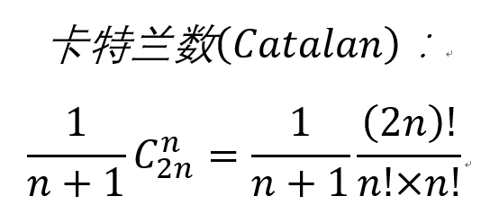

--- 
## 目录
* [线性表](#1)
* [栈和队列](#2)

---
<h2 id="1"> 线性表	</h2>

**[1]**. 若线性表最常用的操作方式是存取第i个元素及其前驱元素和后继元素的值，为了提高效率，应该采用（ ）的存储方式？  
A. 单链表
B. 双向链表
C. 单循环链表
D. 顺序表

**分析：**  
本题正确答案是D，错选了B。题目明显是需要存储i,i+1,i-1位置元素的值，顺序表可以直接通过下标随机访问到这三个值。时间复杂度为O(1),
而其他所有选项都需要遍历来获取第i个元素的值。时间复杂度为O(n)。  

**[2]**. 实现从有序顺序表中删除其值在给定s和t(s<t)之间的所有元素，如果s,t不合理则显示错误信息并退出运行的算法。

**分析：**  
这题我没有理解清楚题目意思，  
1. 题目给定的是有序表，但是没有说明是升序还是降序。这里应该从两个方面讨论，但是参考答案只给出了升序表的
处理方案，于是认为有序表指的是升序表。
2. 题目给出的s,t区间未说明是开区间(s,t)还是闭区间[s,t]，我理解为闭区间，参考答案上是闭区间[s,t]。

我自己的答案：
```cpp
void DeletRange(SeqData& seq, SeqData min, SeqData max)
{
	if (min >= max)
	{
		puts("Error Info: Min-value > Max-value!");
		//exit(-1);
		return ;
	}

	if (seq.IsEmpty())
	{
		puts("Error Info: Sequence list is empty!");
		//exit(-1);
		return ;
	}

	int len = seq.GetLength();
	int start = -1;
	for (;start<len;start++)
	if (seq.data[start++] > min)
		break;

	if (start < 0)
	{
		puts("Error Info: Min-value is too large!");
		//exit(-1);
		return ;
	}

	int end = start;
	for (; end<len; end++)
		if (seq.data[end] > max)
			break;

	if (end == len)
	{
		seq.Clear();
		return ;
	}

	for (; end<len; )
		seq.data[start++] = seq.data[end++];

	seq.length -= (max-min-1);
}
```

参考答案如下：
```cpp
bool DeleteRange(SeqList& seq, SeqData min, SeqData max)
{
	int i,j;
	if (min >= max || seq.length == 0)
		return false;

	//注意这里的for循环内没有执行任何语句
	for (i=0; i<seq.length && seq.data[i]<min; i++) ;

	if (i >= seq.length)
		return false;

	//注意这里的for循环内没有执行任何语句
	for (j=i; j<seq.length && values[j]<=max; j++) ;

	for (; j<seq.length; i++,j++)
		values[i] = values[j];

	seq.length = i;
	return true;
}
```

参考答案通过bool值来返回操作是否成功，但是并未输出错误信息。个人认为不严谨。两个算法的思路是一样的，时间复杂度也一样，同为O(n)。


【2013年计算机联考题】  
**[3]**. 已知一个整数序列A= (a0,a1,a2,...,a(n-1))，其中0≤ai<n (0≤i<n)。若存在a(p1)=a(p2)=a(p3)=...=a(pm)=x
且m>n/2(0≤pk<n, 1≤k≤m)，则称x为A的主元素。例如A=(0,5,5,3,5,7,5,5)，则5为主元素；又如A=(0,5,5,3,5,1,5,7)，则A中没有主元素。
假设A中的n个元素保存在一个一维数组中，请设计出一个尽可能高效的算法，找出A中的主元素。若存在主元素，则输出该元素；否则输出-1。
要求：  
(1) 给出算法的基本设计思想。  
(2) 根据设计思想，采用C/C++/Java语言描述算法，关键之处给出注释。  
(3) 说明该算法的时间复杂度和空间复杂度。  

我的答案：  
(1) 先对A中所有元素进行排序，然后统计排序后出现次数最多的元素，如果该元素出现次数>m/2则为主元素，否则没有主元素。  
(2)
```cpp
int GetMainElement(int* a, int len)
{
	//先对数组进行排序
	Sort(a,len);

	//mainCount记录主元素出现的次数，currentValue记录当前统计的元素值
	int mainCount=1, currentValue=a[0];

	for (int i=1; i<len; i++)
	{
	    if (a[i] == currentValue)
				mainCount++;
	    else
	    {
	    	currentValue = a[i];	//更换统计的元素值
				mainCount = 1;	//重置主元素个数
			}
	}

	//对主元素出现个数进行判断，大于len/2为主元素，否则没有主元素
	return mainCount > len/2 ? currentValue : -1;
}

void Sort(int *a, int len)
{
	for (int i=0; i<len; i++)
		for (int j=0; j<len-i-1; j++)
			if (a[j] > a[j+1])
			   a[j]^=a[j+1]^=a[j]^=a[j+1]; 	//使用位运算无需中间变量即可更换元素值
}
```
(3) 该算法的时间复杂度为O(n^2)，空间复杂度为O(1)。

**分析：**   
本题满分15分，以上解法只能拿到10分。主要丢分点在于时间复杂度太高，该题最优时间复杂度为O(n)，即使是采用快排也可以将时间复杂度缩小到
O(nlog(2)n) （可以拿到11分），但是不知道考试中是否可以直接调用C++库函数sort。  
因此在平时的积累中，应该对排序算法多加深印象，但是这个分值设定也提醒我，**花费大量时间去思考最优算法是得不偿失的** 。  

参考答案：  
(1):   
算法策略是从前向后扫描数组个数，标记出一个可能成为主元素的元素Num，然后重新计数，确认Num是否为主元素。  
算法可以分为以下两步：  
① 选取候选的元素：依次扫描所给数组中的个整数，将第一个遇到的整数num保存到c中，记录Num的出现次数为1，若遇到的下一个整数仍为num，则计数+1，
否则计数减1，当计数减到0时，将遇到的下一个整数保存到c中，计数重新记为1，开始新一轮计数，即从当前位置开始重复上述过程，直到扫描完全部数组元素。  
② 判断c中元素是否为真正的主元素，再次扫描该数组，统计c中元素出现的个数，若大于n/2则为主元素，否则不存在主元素。  

(2):  
```c
int Majority(int A[], int n)
{
	int i,c,count=1;						//c用来保存候选主元素，count用来计数
	c=A[0];									//设置A[0]为主元素
	for (i=1; i<n; i++)						//查找候选主元素
	{
		if (A[i] == c)
			count++;						//对A中的候选主元素计数
		else
		{
			if (count > 0)					//处理不是候选主元素的情况
				count--;
			else							//更换候选主元素，重新计数
			{
				c = A[i];
				count = 1;
			}
		}
	}
		
	if (count > 0)
		for (i=count=0; i<n; i++)			//统计候选主元素出现的实际个数
			if (A[i] == c)
				count++;

	if (count > n/2)						//确认候选主元素
		return c;
	else									//不存在候选主元素
		return -1;
}  
```
(3) 算法的时间复杂度为O(n)，空间复杂度为O(1)


**[4]**.设线性表中有2n个元素，（ ）在单链表上实现要比在顺序表中实现效率更高。  
A. 删除所有值为x的元素  
B. 在最后一个元素的后面插入一个新元素  
C. 顺序输出前k个元素  
D. 交换第i个元素和第2n-i-1个元素的值 （i=0, … ,n-1）

**分析：**  
本题正确答案为A，错选了C。我第一次做这个题的时候以为是题目出错了，因为这个选项中，A的时间复杂度是相同的都是O(n)，B和D明显是顺序表更占优势，可以直接排除，所以在AC之间选了一个C。  
其实，对于“效率”这一个词来说，并不能说是单纯的看时间复杂度，因为时间复杂度只是最高的阶数而已，但是除去最高阶，可能还有系数的差别之类的。  
在线性表中删除所有值为x的元素和在但链表中删除所有值为x的元素的确都需要遍历（一般来说，所有出现“所有”字样的操作都需要遍历整个数据结构）来查找，但是，顺序表需要移动大量的元素，而对于单链表的删除操作来说不需要。从这个角度看，线性表在这一操作上效率是要比顺序表高的，故答案为A。  
至于C，两个都一样的，没啥区别。  

**[5]**.给定有n个元素的一维数组，建立一个有序单链表的最低时间复杂度为（ ）。  
A. O(1)  
B. O(n)  
C. O(n^2)  
D. O(nlog(2)n)  

**分析：**  
本题正确答案为D，错选了C。这个题目要求建立一个有序单链表，而数组并没有说是有序，所以除了建立单链表O(n)，时间复杂度主要花费在排序算法上，值得注意的是，**对数组排序的最优算法时间复杂度为O(nlog(2)n)**。所以答案选D。  

**[6]**.在一个长度为n的带头结点的单链表h上，设有尾指针r。则执行（ ）操作与链表的表长有关。  
A. 删除单链表中的第一个元素  
B. 删除单链表中的最后一个元素  
C. 在单链表第一个元素前插入一个新元素  
D. 在单链表最后一个元素后插入一个新元素

**分析：**
本题正确答案选B，错选了D。  
这题没想明白瞎选了一个，其实这个题很简单，只是需要注意一下，这里所说的单链表是纯粹的单链表，不是c++中的vector或是 ~~c++++~~ (C#)中的List，也就是没法只通过结点a找到结点a的前驱结点。  
所以这题就很简单了，A选项，因为带头结点，所以查找第一个元素和表长根本扯不上什么关系。  
B选项，虽然带了一个尾指针，但是这个尾指针只能快速找到最后一个元素，这是要删除最后一个，删除完之后显然尾指针要更新，新的尾巴是谁呢？是原来尾巴的前驱，单链表并没有办法直接找到前驱，只能通过遍历，这又是尾部，所以要遍历完，也就是说表越长，要遍历的越长，和表长有关。  
C和D很明显不涉及到前驱，和表长扯不上关系。  

**[7]**.设计一个递归算法，删除不带头结点的单链表L中所有值为x的结点。  

**分析：**  
这题我不会做。看了答案觉得答案非常巧妙。  
题目要求比较明确，第一要是递归算法，第二链表是不带头结点的单链表。  
说到递归算法，在确定算法之前，一定要明确几点，1是**递归出口**，什么时候返回要明确，不然就会是个死循环。2是**递归主体**，也就是什么时候进入下一层递归。  
这题的递归出口很明显是空表就返回，但是递归主体我没想到。  
~~其实直到2017.7.30我都没有太看懂这段代码…~~  
参考答案如下：  
```cpp
void Del_X_3(LinkList &l, ElemType x)
{
	LNode *p;					//p指向要删除的结点
	if (l == NULL)				//递归出口
		return ;
	
	if (l->data == x)			//若l所指结点的值为x
	{							//删除*l，并让l指向下一结点
		p = l;
		l = l->next;
		free(p);
		Del_X_3(l, x);			//递归调用
	}
	else						//若l所指结点值不为x
		Del_X_3(l->next, x);	//递归调用
}
```
算法需要借助一个递归工作栈，深度为O(n)，时间复杂度为O(n)，这里L是引用，是直接对原链表进行操作，因此free(p)不会断链。  

**[8]**.设L为带头结点的单链表，编写算法实现从尾到头反向输出每个结点的值。

**分析：**  
这题目没有啥要求，只要实现功能就行。这题最简单粗暴的解法是每输出一个值就重新遍历一遍来查找上一次输出结点的前驱输出。但是这样做很不划算，这里给出几种办法，代码就不贴了，给出思路。  
> 1. 先将单链表逆序，然后顺序输出。  
> 2. 借助栈，先将链表元素压入栈内，后从栈内依次弹出即为逆序。
> 3. 采用递归思想，从后往前输出。  

这里的第3种思路非常独特而巧妙，在这里贴一下代码：  
```cpp
void PrintR(LinkList l)
{
	if (l->next != NULL)
		PrintR(l->next);
	else
		cout<<l->data;
}
```

**[9]**.给定两个单链表，编写算法找出两个链表的公共结点。  

**分析：**  
本题最简单粗暴的办法就是用一个嵌套for循环来查找是否有相同的结点，记链表长度分别为l1,l2，则这样时间复杂度高达O(l1*l2)，只能作为保底方法使用。   
要想高效的解决这个问题最关键的地方在与**如果两个链表有公共结点，因为链表的结点仅有一个后继元素，所以两个链表在公共结点之后的所有结点都是公共的。也就是拓扑结构形如一个Y字形的图示而不可能是X形的图示。同时也即他们的尾结点一定是一样的。**  
题目没有给出两个链表长度相同的条件，所以这两个长度是不确定的。对于长度不相同的两个链表，这种情况很容易想到**尾部对齐**，其实现非常简单：设置两个指针分别指向两个链表的头指针/头结点，指向长度较长的那一个链表的指针先走长度的绝对值差步数后另一个指针才开始移动，这样就保证两个指针一定能同时到达尾部。  
如果对于两个尾部对齐的指针，有在某一步发现两个结点相同，就说明找到了公共结点。  
本题参考答案代码如下：  （代码不重要，重要的是思路）
```cpp
LinkList Search_1st_Common(LinkList L1, LinkList L2)
{
	int len1 = Length(L1), len2 = Length(L2);
	int dist = 0;
	LinkList longList, shortList;

	if (len1 > len2)
	{
		longList = L1->next;
		shortList = L2->next;

		dist = len1-len2;
	}
	else
	{
		longList = L2->next;
		shortList = L1->next;

		dist = len2-len1;
	}

	//尾部对齐
	while(dist--)
		longList = longList->next;

	whlie(longList != NULL)
	{
		if (longList == shortList)
			return longList;
		else
		{
			longList = longList->next;
			shortList = shortList->next;
		}
	}
	
	return NULL;
}
```

[2015年计算机联考试题]  
**[10]**.用单链表保存m个整数，结点的结构为 [data][link]，且|data|≤n（n为正整数）。现要求设计一个时间复杂度尽可能高的算法，对于链表中data的绝对值相等的结点，仅保留第一次出现的结点而删除其余绝对值相等的结点。  
例如给定的单链表如下：  
head-> 21 -> 15 -> -15 -> -7 -> 15 ->NULL  
则删除结点后的链表如下：  
head-> 21 -> 15 -> -7 -> NULL  
要求：  
1）给出算法的基本设计思想。  
2）使用c/c++语言，给出单链表结点的数据类型定义。  
3）根据设计思想，采用c/c++语言描述算法，关键之处给出注释。  
4）说明你所设计的算法的时间复杂度和空间复杂度。  

**分析：**  
本题题干没有要求“尽可能高效的空间复杂度”说明本题如果要达到最优时间复杂度O(n)可能需要借助辅助空间（因为题目要求删除**所有**绝对值相同的点，所以时间复杂度最优为O(n)）。  
这样的话，很容易想到使用一个数组来记录结点中出现过的数的绝对值，这样只需要扫描一次链表就可以完成操作。  

参考答案：  
1）算法的基本设计思想：核心思想是用空间换时间。使用辅助数组记录链表中已出现的数值，从而只对链表进行一躺扫描。  
因为|data|≤n，故辅助数组q的大小为n+1，各元素的初值为0。依次扫描链表中的结点，同时检查q[|data|]的值，如果为0，则保留该结点，并令q[|data|]=1；否则删除该结点。  
2）使用C语言描述的单链表结点的数据类型定义  
```c
typedef struct node
{
	int data;
	struct node *link;
}NODE, *PNODE;
```
3）算法实现  
```c
void func (PNODE h, int n)
{
	PNODE p=h,r;
	int *q,m;
	q= (int*)malloc(sizeof(int)*(n+1));	//申请n+1个位置的辅助空间
	for (int i=0; i< n+1; i++)			//数组元素初值为0
		*(q+1)=0;
	while(p->link != NULL)
	{
		m=p->link->data > 0 ? p->link->data : -p->link->data;
		if (*(q+m)==0)			//判断该结点的data是否已出现过
		{				
			*(q+m)=1;			//首次出现
			p=p->link;			//保留
		}
		else
		{
			r=p->link;			//重复出现
			p->link = r->link;		//删除
			free(r);
		}
	}

	free(q);
}
```
4）时间复杂度和空间复杂度均为O(n)。

 <a href="#">返回本文目录</a>

--- 
<h2 id="2">栈和队列</h2>

**[11]**.设链表不带头结点且所有操作均在表头进行，则下列最不合适作为链栈的是（ ）。  
A. 只有表头结点指针，没有表尾结点指针的双向循环链表。  
B. 只有表尾结点指针，没有表头结点指针的双向循环链表。  
C. 只有表头结点指针，没有表尾节点指针的单向循环链表。  
D. 只有表尾节点指针，没有表头结点指针的单向循环链表。  

**分析：**  
本题正确答案为C，错选了D。  
这题我是秒做的，首先排除了A和B，因为作为一个双向循环链表，随便怎么删头和尾巴都能很容易恢复成双向循环链表。  
而C和D中我选了D，因为我第一反应是对于一个单向循环链表来说，如果删除了表尾结点，要恢复成循环链表需要去找到新的表尾是一件比较麻烦的事情，其实不然，对于一个没有表尾的单向循环链表作为链栈。 **根本就不会去删除表尾啊！** 一个栈只对头进行操作啊！  
下次做题一定要仔细，不能逞英雄，何况自己现在真的渣渣。


**[12]**.3个不同元素依次进栈，能得到（ ）种不同的出栈序列。  
A.4  
B.5  
C.6  
D.7  

**分析：**  
答案选B。  
这题很简单，我只是想要贴一个公式在这里做下记录（可以用数学归纳法证明，这里省略）：  
**卡特兰数公式** 对于n个不同元素进栈，出栈序列的个数为1/(n+1) C_2n^n=1/(n+1)  (2n)!/(n!×n!)  
  

**[13]**.一个栈的输入序列是1,2,3,4,...,n，输出序列的第一个元素为i，则第j个输出元素是（ ）？  
A. i-j-1  
B. i-j  
C. j-i+1  
D. 不确定  

**分析：**  
正确答案选D，错选了C。  
本题如果题目说的是输出序列的第一个元素为n，则答案为C，但是第i个元素可能是在j之前也可能是在j之后，所以不确定。   

【2013年计算机联考真题】  
**[14]**.一个栈的入栈序列是1，2，3，…，n，其出栈序列为P1，P2，P3，…，Pn。若P2=3，则P3可能取值的个数是（ ）。  
A. n-3  
B. n-2  
C. n-1  
D. 无法确定  

**分析：**  
本题答案选C，我不会做。（2017/08/06）  

**[15]**.若用数组A[0..5]来实现循环队列，且当前rear和front的值分别为1和5，当从队列中删除一个元素，再加入两个元素后，rear和front的值分别为（ ）。  
A. 0, 0  
B. 0, n-1  
C. n-1, 0  
D. n-1, n-1  

**分析**  
本题答案选B。错选了A。  
主要是front的计算出现了错误。循环队列中，删除一个元素，队首指针：front=(front+1)%MAXSIZE，插入一个元素，队尾指针：rear=(rear+1)%MAXSIZE。代入题目中答案为A。  

【2011年计算机联考真题】  
**[16]**.已知循环队列存储在一维数组A[0...n-1]中，且队列非空时front和rear分别指向队头元素和队尾元素。若初始时队列为空，且要求第一个进入队列的元素存储在A[0]处，则初始时front和rear的值分别是（ ）。  
A. 0, 0  
B. 0, n-1  
C. n-1, 0  
D. n-1, n-1  

**分析：**  
本题答案选B，错选了A。  
这题我知道一定有个地方有坑，但是始终没有发现在哪，就按照自己的理解，队列初始时为空，则队头指针和队尾指针相等。第一个进入队列的元素存储在A[0]处，则有front=rear=0。  
这应该是经典的错法了…  
再回顾一下，循环队列的入队操作和出对操作：  
出队：q.front=(q.front+1) % MAXSIZE  
入队：q.rear=(q.rear+1) % MAXSIZE  
但是题目中要求第一个入队的元素存储在A[0]处，此时front=rear=0，入队操作需要修改rear指针，即在入队一个元素之后rear=0，即0 = (rear+1) % n => rear+1=n => rear = n-1。而第一个元素存放在A[0]处，即队头指针不需要移动，此时front=0，rear=n-1。答案选B。  

**[17]**.假设循环单链表表示的队列长度为n，队头固定在链表表尾。若只设头指针，则进队操作的时间复杂度为（ ）。  
A. O(n)  
B. O(1)  
C. O(n^2)  
D. O(nlog(2)n)  

**分析：**  
本题答案选A，错选了B。  
当时做题的时候只考虑了队列的性质，在该题的条件下队列的进队操作时间复杂度为O(1)。但是没有考虑到这是一个循环单链表，在进队操作之后，**还需保持循环的性质**。在一个只有头结点的单链表中，查找表尾的复杂度为O(n)，所以本题应该答案为O(n)。之前也做错了这样的题（如本文第4和第11题），之后的复习中，一定要注意这方面的问题，考虑问题要考虑到本质上底层的操作而不是仅仅考虑表面的东西，毕竟考研是一个综合性的考试，不可能单纯只涉及到一个知识点。

【2012年计算机联考真题】  
**[18]**. 已知操作符包括'+'、'-'、'/'、'('、')'。将中缀表达式a+b-a* ((c+d)/e-f)+g转换为等价的后缀表达式ab+acd+e/f-*-g+时，用栈来存放暂时还不能确定运算次序的操作符。若栈初始时为空，则转换过程中同时保存在栈中的操作数的最大个数是（ ）。  
A. 5  
B. 7  
C. 8  
D. 11  

**分析：**  
本题考查栈在中缀表达式转后缀表达式中的应用。将中缀表达式转换为相对应的后缀表达式，需要根据操作符<op>的优先级来进行栈的变化。具体转换过程如下：（下表屏幕大于9.7寸设备可见）  

扫描项 | 栈内内容 | 输出（后缀表达式） |操作
|------- | ------- | ------- | ------- | ------- 
a | | a | 操作数直接加入后缀表达式|
+ |+| a|操作符，此时栈内为空（也可以理解为栈内为#），isp(#)<icp(+),入栈|
b |+|ab|操作数直接加入后缀表达式|
- |-|ab+|操作符，isp(+)>icp(-)，+出栈加入后缀表达式，-入栈|
a|-|ab+a|操作数直接加入后缀表达式|
* |-* |ab+a|操作符，icp(*)>isp(-)， *入栈|
(|-* (|ab+a|左括号，icp(‘(’)>isp(* ), (入栈|
(|-* ((|ab+a|左括号，icp(‘(’)>isp(‘(’ ), (入栈|
c|-* ((|ab+ac|操作数直接加入后缀表达式|
+|-* ((+|ab+ac|操作符，icp(+)>isp(‘(’),+入栈|
d|-* ((+|ab+acd|操作数直接加入后缀表达式|
)|-* (|ab+acd+|遇到右括号将栈中操作符弹出至最近的一个左括号为止|
/|-* (/|ab+acd+|isp(‘(’)<icp(/)，/入栈|
e|-* ( /|ab+acd+e|操作数直接加入后缀表达式|
-|-* ( -|ab+acd+e/|isp(/)>icp(-)，/弹栈加入后缀表达式|
f|-* ( -|ab+acd+e/f|操作数直接加入后缀表达式|
)|-*|ab+acd+e/f-|遇到右括号将栈中操作符弹出至最近的一个左括号为止|
+|+|ab+acd+e/f-\*-|isp(\*)>icp(+)，\*弹栈，isp(-)>icp(+),-弹栈，+入栈|
g|+ |ab+acd+e/f-\*-g|操作数直接加入后缀表达式|
 ||ab+acd+e/f-\*-g+|扫描结束，将栈全部弹出加入后缀表达式|

这就是使用栈对整个表达式进行扫描的结果，从表中可以看出，栈内最多的情况下是在扫描到+和d的时候，此时栈内有5个元素，所以答案选A。  

值得注意的是，如果题目需要求后缀（前缀）表达式的时候没有必要使用这种办法，可以使用手工算法如下：
1. 按照运算符的优先级对所有的运算单元加括号。
2. 转化为前缀表达式则将运算符移到该括号前面，转为后缀表达式则将运算符移到括号后面。
3. 去掉所有括号。  

按照这种办法对题目中的中缀表达式进行转化如下：  
1. 加括号变成 (((a+b)-(a*(((c+d)/e)-f)))+g)
2. 将运算符移到括号后面变成  (((ab)+(a(((cd)+e)/f)-)*-)g)+
3. 去掉所有括号变成 ab+-acd+e/f-*g+

**[19]**. 利用一个栈实现以下递归函数的非递归计算：  
```
         ┌ 1                             n=0  
P(n)(x)= ┼ 2x                            n=1  
         └ 2xP(n-1)(x)-2(n-1)P(n-2)(x)   n>1  

其中n、n-1、n-2为下标，x为自变量
```  

**分析：**  
算法思想：设置一个栈用于保存n和对应的P值，栈中相邻元素的P值有上述表达式关系，然后边出栈边计算P，栈空后该值就计算完成了。  
代码如下：
```cpp
struct stack
{
	int num;
	double value;
}st[MAXSIZE];

double p(int n, double x)
{
	int top = -1;
	double pv1 = 1,pv2 = 2*x;
	
	for (int i = n;i >=2; i--)	
		st[++top].num = i;
	
	while (top > 0)
	{
		st[top].value = 2*x*pv2-2*(st[top].num-1)*pv1;
		pv1 = pv2;
		pv2 = st[top--].value;
	}

	if (n == 0)
		return pv1;
	
	return pv2;
	
}
```


 <a href="#">返回本文目录</a>

--- 
<center>  
 <a href="../entranceExamSummary">返回复习目录</a>
</center>
